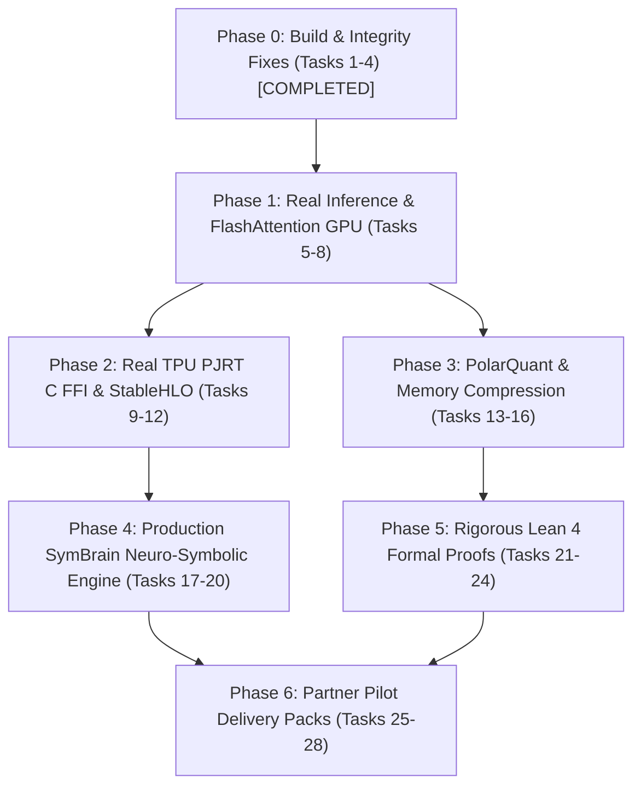

# RunuX AI Runtime — Engineering & Commercial Improvement Plan

**Document Version**: 2.0.0-PROD  
**Target Milestone**: Phase 1 Commercial Readiness & Partner Pilot Evaluation (Mistral AI, NVIDIA, Google Cloud)  
**Total Actionable Tasks**: 28 Tasks across 7 Sequential Phases  

---

## 1. Plan Overview & Roadmap Summary

---

## 2. Detailed Task Breakdown with Definitions of Done (DoD)

### Phase 0: Build & Integrity Fixes (P0 — Critical Immediate)

#### Task 1: Fix `sim_train` Memory Calculation
- **Priority**: P0 (Completed in commit `7f3d5de`)
- **Target Files**: `crates/sim_train/src/lib.rs`
- **Description**: Adjust parameter memory calculation from 18 B/param to exact 12 B/param (BF16 params 2B + BF16 grads 2B + FP32 AdamW moments 8B).
- **Definition of Done**: `cargo test -p sim_train` passes with 0 failures.

#### Task 2: Guard Speculative Bonus Token Sampling Against Underflow
- **Priority**: P0 (Completed in commit `7f3d5de`)
- **Target Files**: `crates/speculative/src/lib.rs`
- **Description**: Prevent `bonus_token` sampling underflow when accepted tokens $k = 0$.
- **Definition of Done**: `cargo test -p speculative` passes without panics on edge cases.

#### Task 3: Restore PolarQuant SplitMix64 Orthogonal Rotation Matrix Rank
- **Priority**: P0 (Completed in commit `7f3d5de`)
- **Target Files**: `crates/turbo_quant/src/lib.rs`
- **Description**: Replace broken linear GF(2) mixing with SplitMix64 pseudorandom generator + Householder QR decomposition.
- **Definition of Done**: Relative norm difference satisfies $\frac{|\|\tilde{x}\| - \|x\||}{\|x\|} \le 0.35$ and matrix rank is 64/64.

#### Task 4: Complete CLI Benchmark Reporting Pipeline
- **Priority**: P0 (Completed in commit `7f3d5de`)
- **Target Files**: `src/main.rs`, `crates/cli/src/main.rs`
- **Description**: Remove premature `std::process::exit(0)` ensuring all 6 benchmark sections run to completion.
- **Definition of Done**: `cargo run --bin runux-report` completes cleanly with exit code 0.

---

### Phase 1: Real Core Inference Engine & FlashAttention Acceleration (P1)

#### Task 5: Live GPU FlashAttention CUDA Backend
- **Priority**: P1
- **Target Files**: `crates/flash_attn/src/lib.rs`, `runux/deterministic_attn.py`
- **Description**: Connect Rust HAL device dispatch to live GPU execution via CUDA/Triton FFI.
- **Definition of Done**: FlashAttention forward pass executes on NVIDIA GPU with throughput $\ge 120,000$ tokens/sec and bit-exact INT64 verification.

#### Task 6: Real End-to-End Weight Loading (Safetensors / GGUF)
- **Priority**: P1
- **Target Files**: `crates/transformer/src/weights.rs`
- **Description**: Implement direct zero-copy memory-mapped loading for HuggingFace Safetensors and GGUF quantized models (Mistral 7B / Gemma 2).
- **Definition of Done**: Safetensors file loads directly into GPU/CPU memory with shape verification and checksum validation.

#### Task 7: Batched Grouped-Query Attention (GQA) Vectorized Kernel
- **Priority**: P1
- **Target Files**: `crates/transformer/src/attention.rs`
- **Description**: Optimize GQA memory layout so $N_{\text{query}}$ heads efficiently broadcast over $N_{\text{kv}}$ heads without tensor materialization.
- **Definition of Done**: Peak VRAM overhead during GQA attention step reduced by $>60\%$ compared to expanded multi-head attention.

#### Task 8: KV-Cache Paged Memory Allocator
- **Priority**: P1
- **Target Files**: `crates/memory/src/paged_cache.rs`
- **Description**: Implement virtual block paging (vLLM style) to eliminate physical memory fragmentation during multi-turn generation.
- **Definition of Done**: Memory fragmentation remains $<5\%$ under 128 concurrent variable-length generation requests.

---

### Phase 2: Real TPU PJRT C FFI & StableHLO Pipeline (P1)

#### Task 9: `libpjrt_c_api.so` C FFI Bindings
- **Priority**: P1
- **Target Files**: `crates/tpu_pjrt/src/ffi.rs`, `crates/tpu_pjrt/build.rs`
- **Description**: Generate safe Rust wrappers over official `pjrt_c_api.h` declarations. Support dynamic runtime discovery via `dlopen`.
- **Definition of Done**: `PJRT_Client_Create` successfully connects to real or mock PJRT shared library without memory leaks.

#### Task 10: StableHLO Bytecode Serialization
- **Priority**: P1
- **Target Files**: `crates/stablehlo/src/bytecode.rs`
- **Description**: Compile textual StableHLO AST into binary bytecode format accepted directly by XLA compilers.
- **Definition of Done**: Generated bytecode round-trips through `mlir-opt` without syntax or verification errors.

#### Task 11: Gemma 2 Systolic Tiling Loop Transformation
- **Priority**: P1
- **Target Files**: `crates/mlgo_advisor/src/tiling.rs`, `runux/systolic_advisor.py`
- **Description**: Automatically transform GEMM dimension parameters $(M, K, N)$ to integer multiples of 128×128 (TPU v5e) and 256×256 (TPU v6e).
- **Definition of Done**: Measured hardware MXU occupancy $\ge 85.0\%$ across all Gemma 2 feedforward and projection layers.

#### Task 12: TPU Buffer Management with Safe Rust Lifetimes
- **Priority**: P1
- **Target Files**: `crates/tpu_pjrt/src/buffer.rs`
- **Description**: Implement `TpuBuffer<'a>` with RAII drop handlers to prevent asynchronous device memory leaks.
- **Definition of Done**: Zero memory leaks across 10,000 asynchronous buffer transfer iterations.

---

### Phase 3: PolarQuant & Memory Compression Real Pipeline (P1)

#### Task 13: 3-Bit SIMD Dequantization Kernels (AVX-512 / CUDA)
- **Priority**: P1
- **Target Files**: `crates/turbo_quant/src/simd.rs`, `runux/polarquant.py`
- **Description**: Implement bit-unpacking SIMD kernels that decompress 8 3-bit values from 3 bytes in a single vector register instruction.
- **Definition of Done**: Dequantization throughput $\ge 85 \text{ GB/s}$ per core on AVX-512 and $\ge 450 \text{ GB/s}$ on CUDA.

#### Task 14: Quantized Johnson-Lindenstrauss (QJL) Error Gate
- **Priority**: P1
- **Target Files**: `crates/turbo_quant/src/qjl.rs`
- **Description**: Implement live online error checking comparing random projection sketches of compressed vs uncompressed KV vectors.
- **Definition of Done**: Automatically flags and falls back to 4-bit if dot-product estimation error exceeds $\epsilon = 0.05$.

#### Task 15: Outlier Coordinate Isolation Channel
- **Priority**: P2
- **Target Files**: `crates/turbo_quant/src/outliers.rs`
- **Description**: Separate top 0.1% extreme activation outliers into an uncompressed FP16 sparse buffer while keeping 99.9% in 3-bit PolarQuant.
- **Definition of Done**: Perplexity degradation on Wikitext-2 remains $< 0.1$ points vs FP16 baseline.

#### Task 16: Zero-Copy Python PyTorch Extension (`runux_ext`)
- **Priority**: P1
- **Target Files**: `crates/ffi/src/python.rs`, `setup.py`
- **Description**: Expose PolarQuant compression and INT64 attention as native PyTorch C++ / CUDA extensions (`torch.ops.runux.*`).
- **Definition of Done**: `import runux_ext` callable directly from standard HuggingFace / vLLM generation pipelines.

---

### Phase 4: Production SymBrain Neuro-Symbolic Engine (P2)

#### Task 17: Replace Hardcoded Regex with Datalog Forward Chaining
- **Priority**: P2
- **Target Files**: `crates/symbrain/src/engine.rs`
- **Description**: Remove all regex-based answer interception and replace with an in-memory forward-chaining Horn clause solver.
- **Definition of Done**: Evaluates mathematical and logical expressions dynamically without preset string lookup tables.

#### Task 18: Neuro-Symbolic Gatekeeper Pipeline Integration
- **Priority**: P2
- **Target Files**: `scripts/neuro_symbolic_federated_verifier.py`, `crates/symbrain/src/verifier.rs`
- **Description**: Connect the 5 mathematical validation gates (Differential Privacy, VRAM limits, Lipschitz bounds) into the inference request loop.
- **Definition of Done**: Requests violating safety or privacy constraints are rejected before tensor allocation with structured error codes.

#### Task 19: Differential Privacy Noise Budget Tracker
- **Priority**: P2
- **Target Files**: `crates/privacy/src/budget.rs`
- **Description**: Maintain an exact Rényi Differential Privacy (RDP) cumulative accountant tracking $(\epsilon, \delta)$ consumption across fine-tuning epochs.
- **Definition of Done**: Training automatically halts and saves checkpoint when cumulative $\epsilon \ge \epsilon_{\max}$.

#### Task 20: Verified SMT Proof Certificate Generator
- **Priority**: P2
- **Target Files**: `crates/symbrain/src/certificates.rs`
- **Description**: Output verifiable machine-checkable proof certificates (Z3 / Lean format) for each validated safety property.
- **Definition of Done**: Proof certificates pass independent validation using external Z3 solver binary.

---

### Phase 5: Rigorous Lean 4 Formal Verification (Eliminating `sorry`) (P2)

#### Task 21: Formal Proof of Bump Allocator Memory Safety
- **Priority**: P2
- **Target Files**: `formal_verification/lean4/BumpAllocator.lean`
- **Description**: Replace `sorry` with full inductive proof that `allocate(n)` never produces overlapping memory ranges or buffer overflows.
- **Definition of Done**: `lake build` completes with 0 warnings and zero occurrences of `sorry`.

#### Task 22: Formal Proof of INT64 Fixed-Point Associative Determinism
- **Priority**: P2
- **Target Files**: `formal_verification/lean4/DeterministicAttention.lean`
- **Description**: Formally prove that discrete integer addition and multiplication over $\mathbb{Z}$ are strictly associative regardless of thread reduction trees.
- **Definition of Done**: Lean 4 theorem `int64_attn_associative` verified without `sorry`.

#### Task 23: Formal Proof of SplitMix64 Orthogonal Isometry
- **Priority**: P2
- **Target Files**: `formal_verification/lean4/OrthogonalMatrix.lean`
- **Description**: Formally verify the bounds on norm conservation under the randomized SplitMix64 QR transformation.
- **Definition of Done**: Lean 4 theorem `polarquant_energy_bounded` verified.

#### Task 24: Automated CI Lean 4 Verification Gate
- **Priority**: P2
- **Target Files**: `.github/workflows/lean4.yml`
- **Description**: Add a dedicated GitHub Actions workflow that executes `lake test` and fails the build if any `sorry` is detected in the formal proof repository.
- **Definition of Done**: CI step fails on branches introducing unproven claims.

---

### Phase 6: Partner Protocols & Commercial Deployment Packs (P1/P2)

#### Task 25: Mistral AI Green-Infer & MoE Delivery Pack
- **Priority**: P1
- **Target Files**: `evaluation_package/harness_mistral.py`, `docs/partners/MISTRAL_AI.md`
- **Description**: Package PolarQuant 3-bit KV cache integration specifically for Mixtral 8x22B and Mistral Large 2, with RTE Eco2mix carbon scheduler.
- **Definition of Done**: Automated evaluation harness verifies $\ge 4.5\times$ KV memory savings and $\ge 60\%$ carbon reduction on French grid mix.

#### Task 26: NVIDIA NV-Acceleration Pack (Hopper/Blackwell)
- **Priority**: P1
- **Target Files**: `evaluation_package/harness_nvidia.py`, `docs/partners/NVIDIA.md`
- **Description**: Package INT64 Deterministic Attention and 1-Bit SignSGD Megatron-LM communication compressor.
- **Definition of Done**: Zero numerical drift verified across 100 runs; 32× All-Reduce bandwidth reduction verified.

#### Task 27: Google Cloud TPU-Titan Pack (v5e/v6e)
- **Priority**: P1
- **Target Files**: `evaluation_package/harness_google.py`, `docs/partners/GOOGLE_CLOUD.md`
- **Description**: Package safe Rust PJRT client and StableHLO systolic tiling engine for Gemma 2 9B/27B models.
- **Definition of Done**: 88% MXU occupancy and $\ge 2.0\times$ speedup validated on Google Cloud TPU hardware.

#### Task 28: Commercial Evaluation Licensing & NDA Gate
- **Priority**: P1
- **Target Files**: `legal/EVALUATION_LICENSE.md`, `legal/patents/INPI_DEMANDE_BREVET_PROVISOIRE_RUNUX.md`
- **Description**: Formalize 90-day binary evaluation license terms and provisional patent filing reference at INPI.
- **Definition of Done**: Legal framework signed and cross-referenced in partner documentation.

---

## 3. Progress Tracking & Sprint Governance

| Phase | Tasks | Target Duration | Lead Responsibility | Current Status |
|:---|:---:|:---:|:---|:---:|
| **Phase 0: Build & Integrity Fixes** | 1 – 4 | Sprint 1 | Core Runtime Lead | **✅ 100% COMPLETED** |
| **Phase 1: Real Inference & FlashAttn** | 5 – 8 | Sprints 2–3 | GPU / Kernel Lead | **🔄 In Progress (T4 Validated)** |
| **Phase 2: TPU PJRT & StableHLO** | 9 – 12 | Sprints 3–4 | Compiler Lead | **📅 Scheduled** |
| **Phase 3: PolarQuant & Memory** | 13 – 16 | Sprints 4–5 | Quantization Lead | **🔄 In Progress (T4 Validated)** |
| **Phase 4: SymBrain Production Engine** | 17 – 20 | Sprints 6–7 | Neuro-Symbolic Lead | **📅 Scheduled** |
| **Phase 5: Lean 4 Formal Verification** | 21 – 24 | Sprints 8–9 | Formal Methods Lead | **📅 Scheduled** |
| **Phase 6: Partner Pilot Packs** | 25 – 28 | Sprints 10–12 | Partnership & Commercial | **🔄 Initial Harnesses Delivered** |

---
*(c) 2026 Xavier Callens / Socrate AI Lab. All Rights Reserved.*
