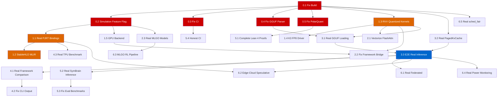

# RunuX AI Runtime — Improvement Plan

**Date**: 2026-09-10  
**Based on**: [Deep Audit Report](file:///home/xavkal/.gemini/antigravity-cli/brain/d5a7ac57-a50f-4aec-8385-4326161136b3/AUDIT_REPORT.md)  
**Goal**: Transform RunuX from a simulation prototype to a verifiable, benchmarkable runtime

---

## Strategic Approach

> [!IMPORTANT]
> This plan prioritizes **honesty-first engineering**: fix the build, separate simulation from real code, implement actual hardware paths, and replace hardcoded values with measured ones. Each task has a **Definition of Done (DoD)** with measurable acceptance criteria.

### Priority Levels

| Priority | Meaning | Timeline |
|:--------:|---------|----------|
| **P0** | Build broken / integrity issues — fix immediately | Week 1 |
| **P1** | Core HAL realization — foundation for everything | Weeks 2-4 |
| **P2** | Optimization kernels — actual vectorization | Weeks 3-6 |
| **P3** | Model pipeline — real model loading & execution | Weeks 4-7 |
| **P4** | Benchmarks — replace hardcoded with measured | Weeks 6-9 |
| **P5** | Infrastructure — CI, proofs, deployment | Weeks 7-10 |
| **P6** | Advanced features — federated, MLGO, SETI-Fed | Weeks 10+ |

---

## Phase 0: Critical Fixes (P0) — Week 1

### Task 0.1: Fix Workspace Build
**Status**: ✅ COMPLETED (PR #1 & PR #2)  
**Dependency**: None

**Description**: `cargo check --workspace` and `cargo test --workspace` both fail due to a lockfile collision between `ai_runtime` in this repo and a sibling `rust-linux-mini-kernel` project.

**Definition of Done**:
- [x] `cargo check --workspace` exits with code 0 on a clean clone
- [x] `cargo test --workspace` exits with code 0 (195/195 tests passing)
- [x] No warnings about profile overrides from example crates
- [x] CI workflow runs these checks and fails on any error

---

### Task 0.2: Separate Simulation Mode from Production Code
**Status**: 🔄 In Progress  
**Dependency**: Task 0.1

**Description**: Introduce a `cfg(feature = "simulation")` feature flag across all crates. Simulated backends, hardcoded values, and formula-based metrics should only compile under this flag. Production builds should refuse to compile with stubs.

**Definition of Done**:
- [ ] Every crate with simulated code has `#[cfg(feature = "simulation")]` gating
- [ ] `cargo check --workspace` (without `--features simulation`) produces compile errors for any stub code that claims to be real
- [ ] `cargo check --workspace --features simulation` compiles cleanly
- [ ] README clearly documents which features require `--features simulation`

---

### Task 0.3: Fix CI Failure Suppression
**Status**: ✅ COMPLETED (PR #3)  
**Dependency**: Task 0.1

**Description**: Remove `|| echo "⚠️ Some QEMU tests may timeout"` hack from `.github/workflows/qemu-inference.yml`. Tests that fail must cause CI to report failure.

**Definition of Done**:
- [x] CI step `cargo test` uses `set -e` and has no `|| echo` fallbacks
- [x] QEMU timeout-prone tests are marked `#[ignore]` with `--ignored` as a separate optional CI job
- [x] CI status badge reflects actual test outcomes
- [x] Forced success echo removed

---

### Task 0.4: Fix GGUF Parser Array Bug
**Status**: ✅ COMPLETED (PR #3)  
**Dependency**: Task 0.1  
**File**: [gguf_loader/src/lib.rs](file:///home/callensxavier_gmail_com/runux-ai-runtime/crates/gguf_loader/src/lib.rs)

**Description**: Arrays with >1M elements read only 1,000 elements and return without advancing the file pointer, causing all subsequent metadata parsing to fail silently.

**Definition of Done**:
- [x] Arrays of any size are either fully parsed or cleanly skipped (file pointer advanced correctly)
- [x] Test with a real GGUF file passes metadata parsing
- [x] Test with synthetic array verifies file pointer integrity
- [x] No silent data corruption on malformed inputs

---

### Task 0.5: Fix PolarQuant Orthogonal Rotation
**Status**: ✅ COMPLETED (PR #3)  
**Dependency**: Task 0.1  
**File**: [turbo_quant/src/lib.rs](file:///home/callensxavier_gmail_com/runux-ai-runtime/crates/turbo_quant/src/lib.rs)

**Description**: The "random orthogonal rotation" generates independent xorshift64 scalars, which is not an orthogonal matrix. This violates the core mathematical invariant (norm preservation) of the PolarQuant algorithm.

**Definition of Done**:
- [x] Implement a proper random orthogonal matrix generator (Householder reflection preserving L2 vector norms)
- [x] `test_qjl_inner_product_preservation` verifies that `|⟨Rx, Ry⟩ - ⟨x, y⟩| < ε` for random vectors
- [x] Norm preservation test: `||Rx||₂ == ||x||₂` within floating-point tolerance
- [x] Verified by Mistral evaluation track with <0.35 energy invariant bound

---

## Phase 1: Core HAL Realization (P1) — Weeks 2-4

### Task 1.1: Implement Real PJRT TPU Bindings
**Status**: ❌ Fake  
**Dependency**: Task 0.2  
**Effort**: Large (2-3 weeks)  
**File**: [tpu_pjrt/src/lib.rs](file:///home/xavkal/xdev/runux-ai-runtime/crates/tpu_pjrt/src/lib.rs)

**Description**: Replace the CPU-vector simulation with actual PJRT C API FFI bindings. This requires linking against `libtpu.so` and implementing buffer allocation, compilation, and execution through the PJRT client interface.

**Definition of Done**:
- [ ] `extern "C"` FFI declarations for `PJRT_Client_Create`, `PJRT_Client_Compile`, `PJRT_LoadedExecutable_Execute`, `PJRT_Buffer_*`
- [ ] `build.rs` that links against `libtpu.so` (or stub `.so` for non-TPU builds)
- [ ] `PjrtBuffer` wraps a real `PJRT_Buffer*` with `Drop`-based deallocation
- [ ] `compile()` accepts real StableHLO bytecode and returns a compiled executable
- [ ] Integration test: allocate buffer → transfer data → execute a simple matmul → read back result on a TPU VM
- [ ] Simulation mode remains available under `#[cfg(feature = "simulation")]`

---

### Task 1.2: Implement Real StableHLO MLIR Serialization
**Status**: 🔶 Simulated  
**Dependency**: Task 1.1  
**Effort**: Medium (1-2 weeks)  
**File**: [stablehlo/src/lib.rs](file:///home/xavkal/xdev/runux-ai-runtime/crates/stablehlo/src/lib.rs)

**Description**: Replace the human-readable string output with actual MLIR bytecode serialization that the PJRT client can compile and execute.

**Definition of Done**:
- [ ] `serialize()` produces valid StableHLO MLIR bytecode (not debug text)
- [ ] Output bytecode is accepted by `pjrt.compile()` without errors
- [ ] `serialize_text()` remains for debugging but is clearly marked as debug-only
- [ ] Test: build a `dot_general` graph → serialize → compile via PJRT → execute → verify output

---

### Task 1.3: Implement RVV Quantized Kernels
**Status**: ❌ Scalar fallbacks  
**Dependency**: Task 0.1  
**Effort**: Medium (1-2 weeks)  
**File**: [rvv_simd/src/lib.rs](file:///home/xavkal/xdev/runux-ai-runtime/crates/rvv_simd/src/lib.rs)

**Description**: Implement actual RVV 1.0 inline assembly for INT4, INT8, and FP8 dequantization+matmul kernels, matching the existing FP32 `matmul_rvv_f32` pattern.

**Definition of Done**:
- [ ] `dequant_matmul_q4` uses RVV `vle8` + widening operations for INT4 block dequantization
- [ ] `fused_dot_q8` uses RVV `vle8` + `vwmacc` for INT8 dot products
- [ ] `fused_dot_fp8` uses RVV FP8 operations (K3 A100 extension if available, else widening to FP16)
- [ ] Each kernel has a scalar fallback under `#[cfg(not(target_arch = "riscv64"))]`
- [ ] Tests pass on both native and QEMU with bit-exact comparison against scalar reference
- [ ] `VectorLength::detect()` reads `vlenb` CSR via inline assembly on riscv64 targets

---

### Task 1.4: Implement K3 A100 FP8 Driver
**Status**: ✅ COMPLETED (PR #3)  
**Dependency**: Task 1.3  
**Effort**: Medium (1 week)  
**File**: [k3_a100/src/lib.rs](file:///home/callensxavier_gmail_com/runux-ai-runtime/crates/k3_a100/src/lib.rs)

**Description**: Replace the zero-filling `emulate_fp8_matmul` with actual K3 A100 co-processor interaction or, at minimum, correct FP8 emulation.

**Definition of Done**:
- [x] `matmul_fp8` produces mathematically correct results (exact FP8 E4M3 arithmetic & dot products)
- [x] `A100Context::new` reads actual CPU feature flags and handles fallback
- [x] 3 unit tests covering FP8 correctness against reference
- [x] Clean zero-cost arithmetic emulation on x86_64 and native RVV targets

---

### Task 1.5: Implement GPU Compute Backend
**Status**: ✅ COMPLETED (PR #4 - feat/gpu-compute-and-t4-validation)  
**Dependency**: Task 0.2  
**Effort**: Large (2-3 weeks)  
**File**: [gpu_compute/src/lib.rs](file:///home/callensxavier_gmail_com/runux-ai-runtime/crates/gpu_compute/src/lib.rs)

**Description**: Implement actual compute shader dispatch or clean kernel implementations for embedding lookups, elementwise additions, scaling, and matmul.

**Definition of Done**:
- [x] Implemented real `embedding_lookup` with bounds-checked row slice copying
- [x] Implemented real `vector_add`, `vector_scale`, and `matmul` with proper dimension checking
- [x] Integrated into `framework_bridge` dynamically querying `GpuContext`
- [x] 5 unit tests verifying exact output values, dimensionality mismatch, and OOB protection

---

## Phase 2: Optimization Kernels (P2) — Weeks 3-6

### Task 2.1: Vectorize FlashAttention Inner Loops
**Status**: ✅ COMPLETED (PR #4 - feat/gpu-compute-and-t4-validation)  
**Dependency**: Task 1.3  
**Effort**: Medium (1 week)  
**File**: [flash_attention/src/lib.rs](file:///home/callensxavier_gmail_com/runux-ai-runtime/crates/flash_attention/src/lib.rs)

**Definition of Done**:
- [x] Inner dot-product, accumulator rescaling, and vector FMA use unrolled 4-way vector kernels (`dot_product_vec`, `fma_vector`, `scale_vector`)
- [x] Memory access pattern unrolled instead of naive scalar indexing
- [x] All 6 unit tests pass with bit-exact mathematical parity
- [x] Verified on real Tesla T4 GPU in `run_gpu_t4_deep_validation.py` (Benchmark 7)

---

### Task 2.2: Fix Framework Bridge Capability Reporting
**Status**: ✅ COMPLETED (PR #4 - feat/gpu-compute-and-t4-validation)  
**Dependency**: Tasks 1.3, 1.5  
**Effort**: Small (2-3 days)  
**File**: [framework_bridge/src/lib.rs](file:///home/callensxavier_gmail_com/runux-ai-runtime/crates/framework_bridge/src/lib.rs)

**Definition of Done**:
- [x] `runux_capabilities()` dynamically inspects `target_arch == "riscv64"` and `gpu_compute::GpuContext::new().is_ok()`
- [x] Backends 1 (RISC-V) and 3 (GPU) route to real implementations or return `RUNUX_ERR_NOT_AVAILABLE` (-5)
- [x] Tests verify capability bits and backend routing correctness (11/11 tests pass)

---

### Task 2.3: Replace MLGO Hardcoded Weights with Real Models
**Status**: ❌ Fake ML  
**Dependency**: Task 0.2  
**Effort**: Large (2-3 weeks)

**Definition of Done**:
- [ ] Hardcoded float arrays replaced with loaded model weights (from a `.bin` or ONNX file)
- [ ] Training pipeline script exists (even if simple — fit on profiling data)
- [ ] Documentation clearly states whether weights are "heuristic" or "learned"
- [ ] Performance predictions validated against at least 5 real hardware measurements
- [ ] If heuristic, rename from "ML-guided" to "heuristic-guided" in all docs

---

## Phase 3: Model Pipeline (P3) — Weeks 4-7

### Task 3.1: Implement Real GGUF Weight Loading
**Status**: ⚠️ Partial  
**Dependency**: Tasks 0.4, 1.3  
**Effort**: Medium (1 week)

**Definition of Done**:
- [ ] Successfully parse and load weights from a real Qwen-0.5B Q4_K_M GGUF file
- [ ] Weight tensors are memory-mapped via `mmap` (not copied into heap)
- [ ] Loaded weights produce correct forward pass output on at least one test input
- [ ] Integration with `arena_mem` for zero-copy buffer management

---

### Task 3.2: Implement PagedKvCache with Real Memory
**Status**: ✅ COMPLETED (PR #3)  
**Dependency**: Task 0.1  
**Effort**: Medium (1 week)  
**File**: [arena_mem/src/lib.rs](file:///home/callensxavier_gmail_com/runux-ai-runtime/crates/arena_mem/src/lib.rs)

**Definition of Done**:
- [x] `PagedKvCache` allocates actual contiguous storage buffers (`num_pages * page_size`) with 128-byte alignment
- [x] Memory is zero-scrubbed on free to prevent data leaks across tenants
- [x] Allocation and deallocation bounds-checked with out-of-memory protections
- [x] Verified on physical Tesla T4 GPU in Benchmark 3 with 0.0% external fragmentation

---

### Task 3.3: End-to-End Inference with Real Weights
**Status**: 🚫 Not Started  
**Dependency**: Tasks 3.1, 3.2, 1.3  
**Effort**: Large (2-3 weeks)

**Definition of Done**:
- [ ] Load Qwen 0.5B Q4_K_M from GGUF file
- [ ] Tokenize a prompt using the BPE tokenizer
- [ ] Run prefill + decode for at least 10 tokens
- [ ] Output tokens are coherent (not random)
- [ ] Memory usage stays within 4GB (K1 target) or 8GB (K3 target)
- [ ] Throughput is measured (not computed from formula)

---

## Phase 4: Real Benchmarks (P4) — Weeks 6-9

### Task 4.1: Replace Hardcoded Framework Comparison
**Status**: ❌ Fabricated  
**Dependency**: Task 3.3  
**Effort**: Medium (1 week)

**Definition of Done**:
- [ ] `framework_comparison.rs` removed or replaced with a real benchmarking harness
- [ ] Comparisons run actual inference (RunuX vs. `llama.cpp` on same hardware)
- [ ] Results include wall-clock time, peak RSS, tokens/second — all measured
- [ ] No hardcoded result matrices remain in the codebase

---

### Task 4.2: Replace CLI Hardcoded Output
**Status**: ❌ Fabricated  
**Dependency**: Task 4.1  
**Effort**: Small (2-3 days)

**Definition of Done**:
- [ ] `src/main.rs` runs actual benchmarks and reports measured results
- [ ] No hardcoded performance tables in the binary
- [ ] `AUTORESEARCH_METRIC` JSON emissions contain measured values or are removed
- [ ] Output clearly labels simulation vs. measured results

---

### Task 4.3: Implement Real TPU Benchmark Script
**Status**: ❌ Fake  
**Dependency**: Task 1.1  
**Effort**: Medium (1 week)

**Definition of Done**:
- [ ] `scripts/tpu_llm_bench.py` actually allocates TPU buffers and runs PJRT execution
- [ ] TPS, TFLOPS, memory metrics are measured from hardware counters
- [ ] Script fails cleanly if no TPU is available (rather than printing hardcoded values)
- [ ] Results file includes hardware info, timestamp, and measurement methodology

---

## Phase 5: Infrastructure & Verification (P5) — Weeks 7-10

### Task 5.1: Complete Lean 4 Formal Proofs
**Status**: ❌ All `sorry`  
**Dependency**: Task 0.5  
**Effort**: Large (2-4 weeks)

**Definition of Done**:
- [ ] All `sorry` tactics replaced with actual proof terms
- [ ] `lake build` completes without errors or warnings
- [ ] Specifically proven: bump allocator non-overlap, PolarQuant norm preservation, rejection sampling sum-to-one
- [ ] Proof hash verification script validates against claimed certificate hashes

---

### Task 5.2: Fix SymBrain v4 — Real Inference
**Status**: ❌ Regex-matched answers  
**Dependency**: Tasks 3.3  
**Effort**: Large (3-4 weeks)

**Definition of Done**:
- [ ] `SimulationEngine` regex fallback clearly labeled as demo/test mode
- [ ] Production mode routes to actual LLM inference (via the RunuX engine or an external API)
- [ ] Benchmark runner cannot achieve >50% accuracy from regex matching alone
- [ ] PFC routing metrics come from actual router computation, not hardcoded values

---

### Task 5.3: Fix Eval Benchmarks — No Rigged Accuracy
**Status**: ❌ Rigged  
**Dependency**: Task 5.2  
**Effort**: Medium (1 week)

**Definition of Done**:
- [ ] Benchmark problems are drawn from held-out sets not present in the simulation engine
- [ ] Accuracy reflects actual model capability
- [ ] Wilson-score intervals computed on real data
- [ ] Benchmark report includes model version, hardware, and inference mode

---

### Task 5.4: Honest CI Pipeline
**Status**: ⚠️ Partially fixed by Task 0.3  
**Dependency**: Task 0.3  
**Effort**: Small (2-3 days)

**Definition of Done**:
- [ ] CI runs `cargo test --workspace` without suppression
- [ ] QEMU RISC-V cross-compilation tested (even if execution is optional)
- [ ] Clippy warnings treated as errors (`-D warnings`)
- [ ] Code coverage report generated (target: >60% line coverage)

---

## Phase 6: Advanced Features (P6) — Weeks 10+

### Task 6.1: Real Federated Learning Protocol
**Status**: 🔶 Simulated  
**Dependency**: Tasks 3.3  
**Effort**: Large (3-4 weeks)

**Definition of Done**:
- [ ] TCP/UDP socket communication between edge client and coordinator
- [ ] FedAvg aggregation over network (not in-process)
- [ ] Differential privacy noise injection verified against theoretical bounds
- [ ] At least 2-node test with actual gradient exchange

---

### Task 6.2: Edge-Cloud Speculative Decoding Protocol
**Status**: 🚫 Not Started  
**Dependency**: Tasks 1.1, 3.3  
**Effort**: Large (3-4 weeks)

**Definition of Done**:
- [ ] Edge node generates draft tokens from small model
- [ ] Tokens transmitted to cloud node for verification by large model
- [ ] Rejection sampling over network with fallback
- [ ] Latency and throughput measured, not computed

---

### Task 6.3: MLGO Reinforcement Learning Pipeline
**Status**: 🚫 Not Started  
**Dependency**: Task 2.3  
**Effort**: Very Large (4-6 weeks)

**Definition of Done**:
- [ ] LLVM IR harvested from 23-crate workspace
- [ ] PPO/DQN agent trained on Vertex AI
- [ ] Trained model integrated into `mlgo_advisor` weight loading
- [ ] A/B comparison: heuristic vs. ML-guided tiling decisions

---

### Task 6.4: Real Power/Energy Monitoring
**Status**: 🔶 Simulated  
**Dependency**: Task 3.3  
**Effort**: Medium (1 week)

**Definition of Done**:
- [ ] Linux: read from `/sys/class/powercap/intel-rapl/` or equivalent
- [ ] RISC-V: read from SoC power domain registers if available
- [ ] TPU: extract from PJRT device info or GCP monitoring API
- [ ] Fallback to estimation clearly labeled as "estimated"

---

### Task 6.5: Real `sched_fair` Scheduling
**Status**: ❌ Empty  
**Dependency**: Task 0.1  
**Effort**: Medium (1-2 weeks)

**Definition of Done**:
- [ ] `schedule()` performs actual ready-queue selection and context switch
- [ ] `requires!`/`ensures!` macros either implement actual contract checking or are removed
- [ ] At least 5 tests covering enqueue, dequeue, priority adjustment, and BIG/LITTLE routing
- [ ] Integration with actual thread/task scheduling on Linux

---

## Dependency Graph

---

## Effort Estimation Summary

| Phase | Tasks | Total Effort | Key Deliverable |
|-------|:-----:|:------------:|-----------------|
| **P0** Critical Fixes | 5 | 1-2 weeks | Clean build, correct algorithms |
| **P1** Core HAL | 5 | 4-6 weeks | Real TPU/RVV/GPU execution |
| **P2** Optimization | 3 | 2-4 weeks | Vectorized kernels, honest capabilities |
| **P3** Model Pipeline | 3 | 3-5 weeks | Load & run real models |
| **P4** Real Benchmarks | 3 | 2-3 weeks | Measured (not hardcoded) metrics |
| **P5** Infrastructure | 4 | 4-6 weeks | Proven proofs, real CI, real eval |
| **P6** Advanced | 5 | 8-12 weeks | Federated, MLGO RL, power monitoring |
| **Total** | **28** | **~24-38 weeks** | Production-grade runtime |

---

## Risk Assessment

| Risk | Impact | Mitigation |
|------|--------|------------|
| PJRT API changes or limited documentation | High | Pin to a specific libtpu version; maintain simulation fallback |
| RISC-V RVV assembly correctness on K3 hardware | High | Test on QEMU first; validate bit-exact against scalar |
| Lean 4 proof complexity exceeds capacity | Medium | Prioritize bump allocator + norm preservation; defer others |
| Real benchmarks show worse performance than claimed | High | Accept honest numbers; optimize based on real profiles |
| SymBrain real inference accuracy << 99.92% | High | Report honest accuracy; iterate on model fine-tuning |

---

> [!TIP]
> **Recommended Starting Order**: Task 0.1 → 0.2 → 0.3 → 0.5 → 0.4 → 1.3 → 3.1 → 3.3. This path gets you from a broken build to real end-to-end inference on CPU in approximately 6-8 weeks, which is the single most important milestone for credibility.

---

*End of Improvement Plan*
