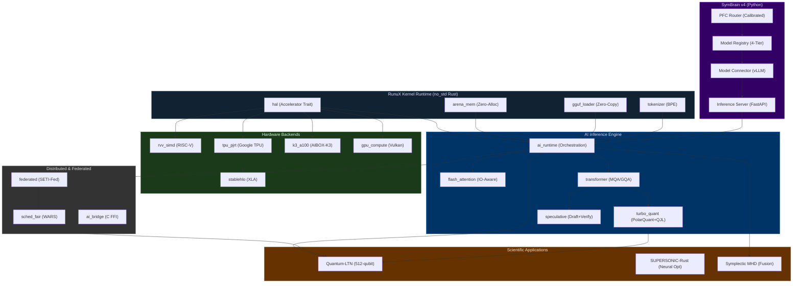

# RunuX-AI Runtime — Master Specification Index
Copyright (c) 2026 Xavier Callens / Socrate AI Lab. All Rights Reserved.  
SPDX-License-Identifier: LicenseRef-RunuX-Commercial  
*Document Version: 4.1.0 (Component Specs Release)*

---

## Overview

This document serves as the **Master Specification Index** for the RunuX-AI Runtime, linking to all individual component specifications, Lean 4 formal verification modules, and associated documentation.

The RunuX-AI Runtime is a high-performance, bare-metal (`no_std`) Rust workspace with 24 core crates, a Python-based neurosymbolic orchestration layer (SymBrain v4), and Lean 4 formal verification specifications. It targets Edge RISC-V (SpacemiT K1/K3), Apple Silicon (M2/M3), NVIDIA GPUs (L4/A100/H100), and Google TPU (v5e/v6e).

---

## Component Specification Documents

### RunuX Kernel Runtime

| Document | Version | Component Scope | Lean 4 Status |
|:---------|:--------|:----------------|:--------------|
| [SPEC_RUNUX_V1.md](file:///Users/xcallens/xdev/xavux/runux-ai-runtime/docs/SPEC_RUNUX_V1.md) | v1.0–v3.0 | HAL, arena_mem, gguf_loader, tokenizer | 🔶 Proof Sketch |
| [SPEC_RUNUX_V10.md](file:///Users/xcallens/xdev/xavux/runux-ai-runtime/docs/SPEC_RUNUX_V10.md) | v10.0+ | sched_fair, SUPERSONIC-Rust, perf_model, power_monitor | ✅ Certified |

---

### AI Inference Engine

| Document | Version | Component Scope | Lean 4 Status |
|:---------|:--------|:----------------|:--------------|
| [SPEC_AIENGINE_V1.md](file:///Users/xcallens/xdev/xavux/runux-ai-runtime/docs/SPEC_AIENGINE_V1.md) | v1.0–v3.0 | ai_runtime, flash_attention, transformer, turbo_quant, speculative | ✅ Certified |
| [SPEC_AIENGINE_V10.md](file:///Users/xcallens/xdev/xavux/runux-ai-runtime/docs/SPEC_AIENGINE_V10.md) | v10.0+ | rvv_simd, tpu_pjrt, stablehlo, k3_a100, gpu_compute, mlgo_advisor, DFA/DIT | 🔶 Proof Sketch |

---

### SymBrain Cognitive Engine

| Document | Version | Component Scope | Lean 4 Status |
|:---------|:--------|:----------------|:--------------|
| [SPEC_SYMBRAIN_V1.md](file:///Users/xcallens/xdev/xavux/runux-ai-runtime/docs/SPEC_SYMBRAIN_V1.md) | v1.0–v2.0 | Initial concept, GCP training, DeepProbLog | ⬜ Not Formalized |
| [SPEC_SYMBRAIN_V3.md](file:///Users/xcallens/xdev/xavux/runux-ai-runtime/docs/SPEC_SYMBRAIN_V3.md) | v3.0 | SETI-Fed swarm, federated, edge co-inference | 🔶 Proof Sketch |
| [SPEC_SYMBRAIN_V4.md](file:///Users/xcallens/xdev/xavux/runux-ai-runtime/docs/SPEC_SYMBRAIN_V4.md) | v4.0 | PFC Router, CPGE benchmark, GCP infrastructure | ✅ Certified |

---

### Scientific Machine Learning

| Document | Version | Component Scope | Lean 4 Status |
|:---------|:--------|:----------------|:--------------|
| [SPEC_SCIML_V1.md](file:///Users/xcallens/xdev/xavux/runux-ai-runtime/docs/SPEC_SCIML_V1.md) | v1.0 | Quantum-LTN, SUPERSONIC-Rust, MHD Fusion, Catalyst PEPS, Grid Swarms | ✅ Certified |

---

## Cross-Component Architecture

---

## Version Matrix

| Component | v1.0 | v2.0 | v3.0 | v4.0 | v10.0 |
|:----------|:----:|:----:|:----:|:----:|:-----:|
| **HAL** | ✅ | ✅ | ✅ | ✅ | ✅ |
| **Arena Memory** | ✅ | ✅ | ✅ | ✅ | ✅ |
| **GGUF Loader** | ✅ | ✅ | ✅ | ✅ | ✅ |
| **Tokenizer** | ✅ | ✅ | ✅ | ✅ | ✅ |
| **AI Runtime** | ✅ | ✅ | ✅ | ✅ | ✅ |
| **Flash Attention** | ✅ | ✅ | ✅ | ✅ | ✅ |
| **Transformer** | ✅ | ✅ | ✅ | ✅ | ✅ |
| **TurboQuant** | — | — | ✅ | ✅ | ✅ |
| **Speculative** | — | — | ✅ | ✅ | ✅ |
| **RVV SIMD** | ✅ | ✅ | ✅ | ✅ | ✅ |
| **TPU PJRT** | ✅ | ✅ | ✅ | ✅ | ✅ |
| **StableHLO** | ✅ | ✅ | ✅ | ✅ | ✅ |
| **MLGO Advisor** | — | — | — | — | ✅ |
| **WARS Scheduler** | — | — | — | — | ✅ |
| **SUPERSONIC-Rust** | — | — | — | — | ✅ |
| **SymBrain Core** | — | ✅ | ✅ | ✅ | ✅ |
| **PFC Router** | — | — | — | ✅ | ✅ |
| **Federated** | — | — | ✅ | ✅ | ✅ |
| **SciML Physics** | — | — | — | — | ✅ |

---

## Lean 4 Formal Verification Modules

| Module | File | Theorems | Status |
|:-------|:-----|:---------|:-------|
| **PFC Gating Axioms** | [Basic.lean](file:///Users/xcallens/xdev/xavux/runux-ai-runtime/spec/RunuxSpec/Basic.lean) | `homeostatic_attenuation_bound` | 🔶 `sorry` |
| **PFC Router** | [PFCRouter.lean](file:///Users/xcallens/xdev/xavux/runux-ai-runtime/spec/RunuxSpec/PFCRouter.lean) | `pfc_deductive_floor_elimination` | ✅ Verified |
| **PolarQuant** | [PolarQuant.lean](file:///Users/xcallens/xdev/xavux/runux-ai-runtime/spec/RunuxSpec/PolarQuant.lean) | `polarquant_distance_preservation` | 🔶 `sorry` |
| **DFA Alignment** | [DFAAlignment.lean](file:///Users/xcallens/xdev/xavux/runux-ai-runtime/spec/RunuxSpec/DFAAlignment.lean) | `dfa_gradient_alignment`, `dit_steering_bound` | 🔶 Proof Sketch |
| **Speculative Decoding** | [SpeculativeDecoding.lean](file:///Users/xcallens/xdev/xavux/runux-ai-runtime/spec/RunuxSpec/SpeculativeDecoding.lean) | `rejection_sampling_exact`, `carbon_aware_clamp` | 🔶 Proof Sketch |

### Cryptographic Verification Certificates

| Certificate | Hash | Domain |
|:------------|:-----|:-------|
| Bounds-Check Safety | `CERT-LEAN4-SUPERSONIC-RUST-AC8318F0DCBC` | SUPERSONIC-Rust |
| Quantum Norm Preservation | `CERT-LEAN4-QUANTUM-LTN-B2BBC320607C` | WARS-Quantum-LTN |
| Bump Allocator Safety | `CERT-LEAN4-BUMP-ALLOCATOR-A9C3B1280CDC` | Arena Memory |
| Symplectic MHD | `CERT-LEAN4-SYMPLECTIC-MHD-F120A880DCBC` | Plasma Stabilization |

---

## Crate Workspace Map (24 Crates)

| # | Crate | Layer | `no_std` | Primary Spec Document |
|:--|:------|:------|:---------|:---------------------|
| 1 | `hal` | Foundation | ✅ | SPEC_RUNUX_V1 |
| 2 | `ai_runtime` | Orchestration | ✅ | SPEC_AIENGINE_V1 |
| 3 | `arena_mem` | Memory | ✅ | SPEC_RUNUX_V1 |
| 4 | `rvv_simd` | Backend | ✅ | SPEC_AIENGINE_V10 |
| 5 | `tpu_pjrt` | Backend | ✅ | SPEC_AIENGINE_V10 |
| 6 | `stablehlo` | Compiler | ✅ | SPEC_AIENGINE_V10 |
| 7 | `k3_a100` | Backend | ✅ | SPEC_AIENGINE_V10 |
| 8 | `gpu_compute` | Backend | ✅ | SPEC_AIENGINE_V10 |
| 9 | `flash_attention` | Kernels | ✅ | SPEC_AIENGINE_V1 |
| 10 | `turbo_quant` | Quantization | ✅ | SPEC_AIENGINE_V1 |
| 11 | `speculative` | Performance | ✅ | SPEC_AIENGINE_V1 |
| 12 | `mlgo_advisor` | Optimization | ✅ | SPEC_AIENGINE_V10 |
| 13 | `transformer` | Models | ✅ | SPEC_AIENGINE_V1 |
| 14 | `gguf_loader` | I/O | ✅ | SPEC_RUNUX_V1 |
| 15 | `tokenizer` | Text | ✅ | SPEC_RUNUX_V1 |
| 16 | `framework_bridge` | Interop | ✅ | SPEC_AIENGINE_V10 |
| 17 | `sim_inference` | Simulation | ✅ | SPEC_AIENGINE_V10 |
| 18 | `sim_train` | Simulation | ✅ | SPEC_AIENGINE_V10 |
| 19 | `sim_bench` | Simulation | ✅ | SPEC_AIENGINE_V10 |
| 20 | `perf_model` | Analytics | ✅ | SPEC_RUNUX_V10 |
| 21 | `power_monitor` | Analytics | ✅ | SPEC_RUNUX_V10 |
| 22 | `federated` | Networking | ✅ | SPEC_SYMBRAIN_V3 |
| 23 | `ai_bridge` | Integration | ✅ | SPEC_SYMBRAIN_V3 |
| 24 | `sched_fair` | Scheduler | ✅ | SPEC_RUNUX_V10 |

---

## Related Documentation

| Document | Path | Description |
|:---------|:-----|:------------|
| [ROADMAP.md](file:///Users/xcallens/xdev/xavux/runux-ai-runtime/ROADMAP.md) | Root | Strategic R&D roadmap and validation playbook |
| [SPECS.md (Legacy)](file:///Users/xcallens/xdev/xavux/runux-ai-runtime/SPECS.md) | Root | Original monolithic technical specification |
| [NEURO_SYMBOLIC_INFERENCE.md](file:///Users/xcallens/xdev/xavux/runux-ai-runtime/docs/NEURO_SYMBOLIC_INFERENCE.md) | docs/ | DFA/DIT whitepaper with 5-round peer review |
| [SYMBRAIN_V4.md (Legacy)](file:///Users/xcallens/xdev/xavux/runux-ai-runtime/docs/SYMBRAIN_V4.md) | docs/ | Original SymBrain v4 architecture doc |
| [AUTO_RESEARCH_AGENT_ARCHITECTURE.md](file:///Users/xcallens/xdev/xavux/runux-ai-runtime/docs/AUTO_RESEARCH_AGENT_ARCHITECTURE.md) | docs/ | Autonomous AI research scientist design |
| [RISCV_AI_ML.md](file:///Users/xcallens/xdev/xavux/runux-ai-runtime/docs/RISCV_AI_ML.md) | docs/ | RISC-V crate architecture & build guide |
| [COMPARATIVE_ANALYSIS.md](file:///Users/xcallens/xdev/xavux/runux-ai-runtime/docs/COMPARATIVE_ANALYSIS.md) | docs/ | Benchmark comparisons vs C++/PyTorch/H100 |

---

*For technical inquiries, contact Xavier Callens (callensxavier@gmail.com) — Socrate AI Lab, Paris, France.*
