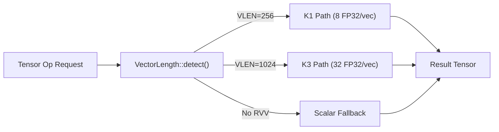
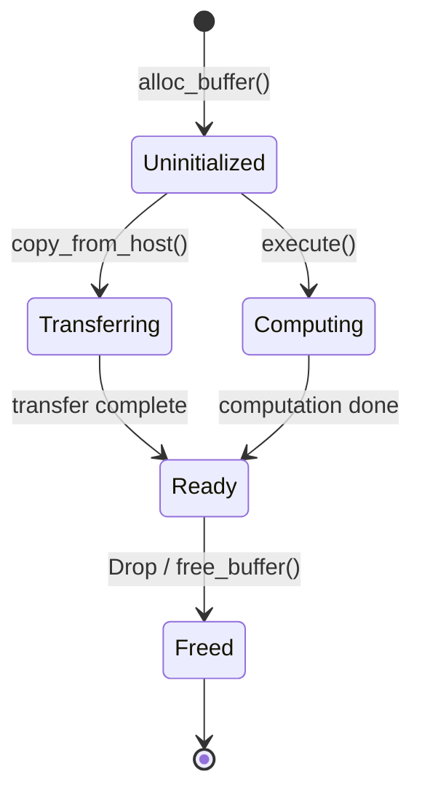
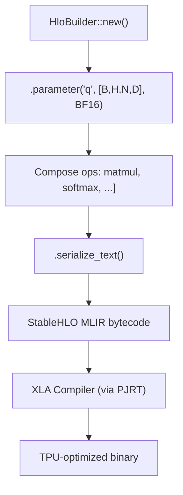
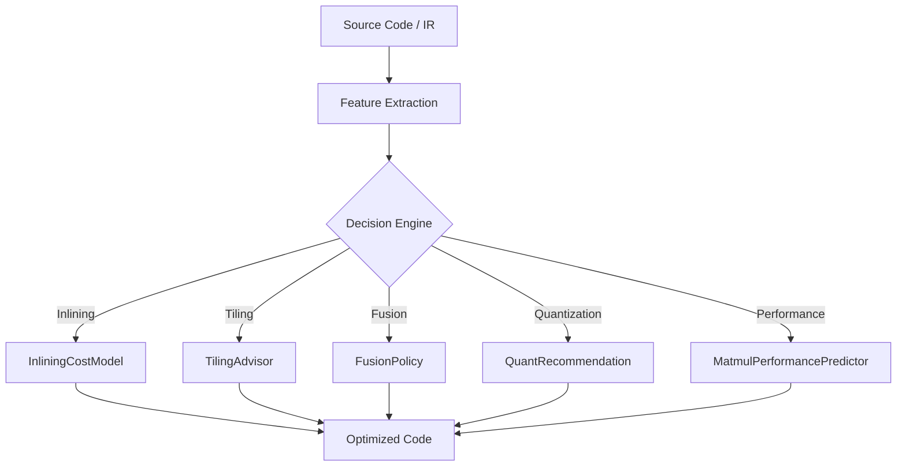
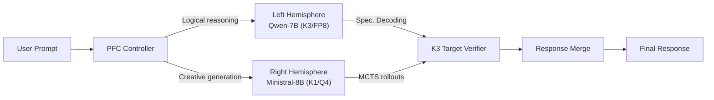

# AI Engine Advanced Backends & Optimization — Technical Specification v10.0

> **RunuX-AI Runtime Project**
> Copyright (c) 2026 Xavier Callens / Socrate AI Lab. All Rights Reserved.
> License: `LicenseRef-RunuX-Commercial`

| Field           | Value                                     |
|-----------------|-------------------------------------------|
| Document ID     | `SPEC-AIENGINE-V10`                       |
| Version         | 10.0.0                                    |
| Status          | **Draft**                                 |
| Author          | Xavier Callens                            |
| Date            | 2026-05-30                                |
| Classification  | Proprietary — Socrate AI Lab              |
| Cross-refs      | `SPEC_AIENGINE_V1.md`, `SPEC_HAL.md`     |

---

## Table of Contents

1. [RVV SIMD Backend (`rvv_simd`)](#1-rvv-simd-backend)
2. [TPU PJRT Backend (`tpu_pjrt`)](#2-tpu-pjrt-backend)
3. [StableHLO Graph Builder (`stablehlo`)](#3-stablehlo-graph-builder)
4. [K3 A100 AI Core Driver (`k3_a100`)](#4-k3-a100-ai-core-driver)
5. [GPU Compute Backend (`gpu_compute`)](#5-gpu-compute-backend)
6. [MLGO Advisor (`mlgo_advisor`)](#6-mlgo-advisor)
7. [DFA/DIT Architecture Integration](#7-dfadit-architecture-integration)
8. [Framework Bridge (`framework_bridge`)](#8-framework-bridge)
9. [Lean 4 Verification](#9-lean-4-verification)
10. [Version History](#10-version-history)

---

## 1. RVV SIMD Backend

**Crate**: `rvv_simd` v0.1.0
**Path**: `crates/rvv_simd/src/lib.rs`
**Attributes**: `#![cfg_attr(not(test), no_std)]`
**Dependencies**: `ai_runtime`

### 1.1 Purpose

The `rvv_simd` crate provides hardware-vectorized implementations of core ML operations using RISC-V Vector Extension (RVV 1.0). All kernels auto-dispatch between scalar fallback, 256-bit K1 (SpacemiT X60), and 1024-bit K3 (SpacemiT X100/A100) vector widths.



### 1.2 Vector Length Detection — `VectorLength`

```rust
#[derive(Debug, Clone, Copy, PartialEq, Eq)]
pub enum VectorLength {
    Vlen128,   // 4 FP32, 16 INT8
    Vlen256,   // 8 FP32, 32 INT8, 64 INT4  — SpacemiT K1
    Vlen512,   // 16 FP32, 64 INT8
    Vlen1024,  // 32 FP32, 128 INT8, 256 INT4 — SpacemiT K3
}
```

| VLEN   | FP32 Elements | INT8 Elements | INT4 Elements | Target Hardware  |
|--------|---------------|---------------|---------------|------------------|
| 128    | 4             | 16            | 32            | Minimal RVV      |
| 256    | 8             | 32            | 64            | SpacemiT K1/X60  |
| 512    | 16            | 64            | 128           | (future)         |
| 1024   | 32            | 128           | 256           | SpacemiT K3/X100 |

**Runtime detection** uses the `vlenb` CSR on real hardware:

```rust
pub fn detect() -> Self {
    // On real RISC-V: csrr vlenb → vlenb * 8 bits
    #[cfg(feature = "k3_a100")]  { return Self::Vlen1024; }
    #[cfg(not(feature = "k3_a100"))] { Self::Vlen256 }
}
```

### 1.3 Matrix Multiplication Kernels

#### 1.3.1 Scalar Fallback — `matmul_scalar_f32`

```rust
pub fn matmul_scalar_f32(
    a: &[f32],        // [M × K]
    b: &[f32],        // [K × N]
    c: &mut [f32],    // [M × N]
    m: usize, k: usize, n: usize,
);
```

Standard triple-loop matmul. Works on any architecture.

**Complexity**: $O(MNK)$ FLOPs, $O(MK + KN + MN)$ memory.

#### 1.3.2 RVV Vectorized — `matmul_rvv_f32`

```rust
#[cfg(target_arch = "riscv64")]
pub fn matmul_rvv_f32(
    a: &[f32], b: &[f32], c: &mut [f32],
    m: usize, k: usize, n: usize,
);
```

Uses inline assembly with RVV instructions:

```text
vsetvli t0, {rem}, e32, m1, ta, ma    -- Set vector length for FP32
vle32.v v16, ({ptr_a})                 -- Vector load A
vle32.v v24, ({ptr_b})                 -- Vector load B
vfmacc.vv v8, v16, v24                -- Fused multiply-accumulate
vfredosum.vs v0, v8, v0               -- Horizontal reduction sum
```

**Throughput model** (K3, VLEN=1024):

$$
T_{\text{matmul}} = \frac{2 \cdot M \cdot N \cdot K}{32 \cdot f_{\text{clk}} \cdot \text{CPI}_{\text{vfma}}}
$$

where 32 is the FP32 elements per vector register on K3 and $\text{CPI}_{\text{vfma}} \approx 1$ for pipelined FMA.

> [!NOTE]
> On non-RISC-V hosts (x86/ARM for testing), `matmul_rvv_f32` delegates to the scalar fallback automatically.

### 1.4 Quantized Kernels

#### 1.4.1 INT4 (Q4_K_M) — GGUF Format

```rust
pub const Q4_BLOCK_SIZE: usize = 32;

#[repr(C)]
pub struct QuantBlockQ4 {
    pub scale: f32,
    pub min: f32,
    pub quants: [u8; Q4_BLOCK_SIZE / 2],  // 16 bytes: 32 × 4-bit
}
```

**Dequantization**:

$$
x_{\text{lo}} = (\text{byte} \mathbin{\&} \texttt{0x0F}) \cdot s + z, \quad
x_{\text{hi}} = (\text{byte} \gg 4) \cdot s + z
$$

where $s = \text{scale}$, $z = \text{min}$ (zero-point offset).

**Fused kernel** (`fused_dot_q4`): Avoids materializing the dequantized weight vector — dequant + multiply + accumulate in a single pass.

```rust
pub fn fused_dot_q4(
    blocks: &[QuantBlockQ4],
    activations: &[f32],
    in_features: usize,
) -> f32;
```

#### 1.4.2 INT8 (Q8_0)

```rust
pub const Q8_BLOCK_SIZE: usize = 32;

#[repr(C)]
pub struct QuantBlockQ8 {
    pub scale: f32,
    pub quants: [i8; Q8_BLOCK_SIZE],
}
```

Symmetric quantization: $x_i = q_i \times s$.

#### 1.4.3 FP8 E4M3 (K3 Native)

```rust
pub fn fp8_e4m3_to_f32(val: u8) -> f32;
pub fn dequant_fp8_e4m3(input: &[u8], output: &mut [f32]);
pub fn fused_dot_fp8(weights: &[u8], activations: &[f32], n: usize) -> f32;
```

**FP8 E4M3 bit layout**: 1 sign + 4 exponent (bias=7) + 3 mantissa bits.

$$
x = (-1)^s \times \left(1 + \frac{m}{8}\right) \times 2^{e - 7}
$$

Range: $\pm 448$. On K3, dequantization is zero-overhead (hardware instruction).

### 1.5 Normalization & Activation Kernels

| Kernel            | Signature                                                         | Formula                                                               |
|-------------------|-------------------------------------------------------------------|-----------------------------------------------------------------------|
| `softmax_f32`     | `fn softmax_f32(x: &mut [f32])`                                  | $\text{softmax}(x_i) = \frac{e^{x_i - \max}}{{\sum_j e^{x_j - \max}}}$ |
| `layer_norm_f32`  | `fn layer_norm_f32(x: &mut [f32], γ: &[f32], β: &[f32], ε)`     | $y_i = \frac{x_i - \mu}{\sqrt{\sigma^2 + \varepsilon}} \gamma_i + \beta_i$ |
| `rms_norm_f32`    | `fn rms_norm_f32(x: &mut [f32], γ: &[f32], ε: f32)`             | $y_i = \frac{x_i}{\sqrt{\text{mean}(x^2) + \varepsilon}} \gamma_i$   |
| `silu_f32`        | `fn silu_f32(x: &mut [f32])`                                     | $\text{SiLU}(x) = x \cdot \sigma(x)$                                 |
| `gelu_f32`        | `fn gelu_f32(x: &mut [f32])`                                     | $\text{GELU}(x) \approx 0.5x(1 + \tanh(\sqrt{2/\pi}(x + 0.044715x^3)))$ |

### 1.6 Rotary Position Embeddings (RoPE)

```rust
pub fn apply_rope_f32(
    x: &mut [f32],
    seq_pos: usize,
    head_dim: usize,
    rope_theta: f32,  // e.g. 10,000 or 1,000,000
);
```

Rotation frequency: $\theta_i = \theta_{\text{base}}^{-2i/d}$.

### 1.7 Fast Math Library (`no_std`)

All functions use IEEE-754 bit manipulation for `no_std` compatibility:

| Function     | Method                                | Max Relative Error |
|--------------|---------------------------------------|--------------------|
| `fast_exp`   | $(1 + x/256)^{256}$ via repeated squaring | ~12%           |
| `sigmoid`    | $1 / (1 + \text{fast\_exp}(-x))$      | Composed           |
| `fast_tanh`  | $2\sigma(2x) - 1$                     | Composed           |
| `fast_sqrt`  | Newton-Raphson, 5 iterations          | < $10^{-6}$        |
| `fast_ln`    | IEEE-754 exponent extraction + poly   | ~2%                |
| `fast_pow`   | $e^{y \ln x}$                         | Composed           |
| `fast_sin`   | Bhaskara I parabolic approximation    | ~1%                |
| `fast_cos`   | $\sin(x + \pi/2)$                     | Composed           |

### 1.8 High-Level Dispatch — `tensor_matmul`

```rust
pub fn tensor_matmul(
    a: &TensorDescriptor,
    b: &TensorDescriptor,
    c: &mut TensorDescriptor,
) -> Result<(), AiError>;
```

Shape-validates, selects optimal kernel, and dispatches.

---

## 2. TPU PJRT Backend

**Crate**: `tpu_pjrt` v0.1.0
**Path**: `crates/tpu_pjrt/src/lib.rs`
**Attributes**: `#![cfg_attr(not(test), no_std)]`
**Dependencies**: `hal`

### 2.1 Purpose

Safe Rust bindings for Google TPU via the PJRT C API. Maps PJRT handles to ownership-aware Rust types with deterministic HBM lifecycle management.

> [!WARNING]
> ⚠️ **Simulation Mode**: When compiled without `feature = "tpu_hw"`, all operations execute on CPU with TPU constraints (tile sizes, memory limits) enforced. This enables full development without TPU access.

### 2.2 Type Mapping

| Rust Type        | PJRT Handle         | Purpose                            | Thread Safety        |
|------------------|----------------------|------------------------------------|----------------------|
| `PjrtClient`     | `PJRT_Client*`      | Entry point, owns devices + memory | Single-threaded      |
| `PjrtDevice`     | `PJRT_Device*`      | Single TPU chip                    | Shared ref           |
| `PjrtBuffer`     | `PJRT_Buffer*`      | HBM tensor with async tracking     | `Drop` for dealloc   |
| `PjrtExecutable` | `PJRT_Executable*`  | Compiled StableHLO program         | `Send + Sync`        |

### 2.3 Buffer Lifecycle — `BufferState`

```rust
#[derive(Debug, Clone, Copy, PartialEq, Eq)]
pub enum BufferState {
    Uninitialized,  // Allocated, no data
    Transferring,   // Host→Device in progress
    Computing,      // Computation producing this buffer
    Ready,          // Safe to read
    Freed,          // Deallocated
}
```



> [!IMPORTANT]
> Reading from a buffer not in `Ready` state returns `PjrtError::BufferNotReady`. This prevents use-after-free and data races that plague C++ PJRT usage.

### 2.4 PjrtBuffer

```rust
pub struct PjrtBuffer {
    pub id: u64,
    pub shape: Shape,
    pub dtype: DType,
    pub state: BufferState,
    pub hbm_bytes: usize,
    pub device_ordinal: u32,
    sim_data: Vec<f32>,  // simulation-only storage
}
```

| Method           | Signature                                              | Description                  |
|------------------|--------------------------------------------------------|------------------------------|
| `copy_from_host` | `fn copy_from_host(&mut self, data: &[f32]) -> Result` | Host → device transfer       |
| `copy_to_host`   | `fn copy_to_host(&self) -> Result<Vec<f32>>`           | Device → host transfer       |
| `is_ready`       | `fn is_ready(&self) -> bool`                           | Check if safe to read        |
| `sim_data`       | `fn sim_data(&self) -> &[f32]`                         | Access simulation data       |

### 2.5 PjrtDevice

```rust
pub struct PjrtDevice {
    pub ordinal: u32,
    pub kind: &'static str,
    pub hbm_total: usize,
    pub hbm_used: usize,
    pub ici_links: u32,
}
```

| Generation | HBM     | MXU Dim | ICI Links | Kind String                        |
|------------|---------|---------|-----------|-------------------------------------|
| v5e        | 16 GB   | 128×128 | 4         | `"TPU v5e (simulated)"`            |
| v6e        | 32 GB   | 256×256 | 6         | `"TPU v6e Trillium (simulated)"`   |

### 2.6 PjrtClient

```rust
pub struct PjrtClient {
    devices: Vec<PjrtDevice>,
    buffers: Vec<PjrtBuffer>,
    next_buffer_id: u64,
    next_exe_id: u64,
    generation: TpuGeneration,
    platform: &'static str,
}

pub enum TpuGeneration { V5e, V6e, Simulator }
```

| Method               | Signature                                                                  | Description                          |
|----------------------|----------------------------------------------------------------------------|--------------------------------------|
| `sim_v5e`            | `fn sim_v5e(n_chips: u32) -> Self`                                        | Create simulated v5e client          |
| `sim_v6e`            | `fn sim_v6e(n_chips: u32) -> Self`                                        | Create simulated v6e client          |
| `mxu_dim`            | `fn mxu_dim(&self) -> usize`                                             | MXU dimension (128 or 256)           |
| `alloc_buffer`       | `fn alloc_buffer(&mut self, shape, dtype, device) -> Result<u64>`         | Allocate HBM buffer                  |
| `free_buffer`        | `fn free_buffer(&mut self, id: u64) -> Result<()>`                        | Free HBM and reclaim memory          |
| `transfer_to_device` | `fn transfer_to_device(&mut self, data, shape, dtype, dev) -> Result<u64>`| Host-to-device + alloc in one step   |
| `transfer_to_host`   | `fn transfer_to_host(&self, buffer_id: u64) -> Result<Vec<f32>>`         | Device-to-host copy                  |
| `compile`            | `fn compile(&mut self, name, n_inputs, n_outputs, flops) -> PjrtExecutable` | Compile StableHLO program         |

### 2.7 Model Planning — `plan_tpu_model`

```rust
pub fn plan_tpu_model(
    model_name: &'static str,
    total_params: u64,
    hidden_dim: usize,
    n_layers: usize,
    n_kv_heads: usize,
    head_dim: usize,
    weight_dtype: DType,
    hbm_bytes: usize,
) -> TpuModelPlan;
```

**HBM budget**:

$$
\text{HBM}_{\text{remaining}} = \text{HBM}_{\text{total}} - W_{\text{bytes}} - A_{\text{bytes}}
$$

**Maximum sequence length**:

$$
L_{\max} = \frac{\text{HBM}_{\text{remaining}}}{2 \cdot H_{kv} \cdot d_k \cdot b(D) \cdot N_{\text{layers}}}
$$

**Fit criterion**: $W_{\text{bytes}} < \text{HBM}_{\text{total}}$ AND $L_{\max} \geq 512$.

| Model          | Params | Dtype | HBM    | Fits v5e? | Max Seq |
|----------------|--------|-------|--------|-----------|---------|
| Llama 7B       | 7B     | BF16  | 16 GB  | ✓         | ~2K+    |
| Llama 70B      | 70B    | BF16  | 16 GB  | ✗         | —       |
| DeepSeek R1 7B | 7B     | BF16  | 32 GB  | ✓         | ~8K+    |

---

## 3. StableHLO Graph Builder

**Crate**: `stablehlo` v0.1.0
**Path**: `crates/stablehlo/src/lib.rs`
**Attributes**: `#![cfg_attr(not(test), no_std)]`
**Dependencies**: `hal`

### 3.1 Purpose

Programmatic construction of StableHLO (MLIR dialect) computation graphs in type-safe Rust. Graphs are compiled by XLA to optimized TPU/GPU/CPU kernels.

> [!TIP]
> Key advantages over hand-written HLO:
> 1. **Type safety** — Shape mismatches caught at build time
> 2. **`no_std`** — Graphs built on embedded RISC-V, compiled on cloud TPU
> 3. **Composable** — FlashAttention, RoPE as reusable graph fragments
> 4. **Deterministic** — Same graph for same inputs



### 3.2 HLO Type System

```rust
pub enum HloElementType {
    F32, F16, BF16, S32, S8, U8, Pred,
}

pub struct HloShape {
    pub dims: Vec<usize>,
    pub element_type: HloElementType,
}
```

**DType → HloElementType conversion**: `F32 → F32`, `BF16 → BF16`, `INT8/Q8_0 → S8`, fallback → `F32`.

### 3.3 Operation Types — `HloOpKind`

```rust
pub enum HloOpKind {
    Parameter { index: usize },
    Constant { value: f32 },
    DotGeneral { lhs_contracting: Vec<usize>, rhs_contracting: Vec<usize> },
    Add, Multiply, Exp, Log, Maximum, Divide, Negate,
    Reduce { axis: i64, reduce_kind: ReduceKind },
    Broadcast { target_dims: Vec<usize> },
    Reshape { new_dims: Vec<usize> },
    Transpose { permutation: Vec<usize> },
    Slice { starts: Vec<usize>, limits: Vec<usize> },
    CustomCall { call_name: String },
}

pub enum ReduceKind { Sum, Max, Min }
```

### 3.4 HloBuilder API

```rust
pub struct HloBuilder {
    ops: Vec<HloOp>,
    next_id: HloId,
    name: String,
}
```

| Method                   | Signature (simplified)                                         | Description                        |
|--------------------------|----------------------------------------------------------------|------------------------------------|
| `new`                    | `fn new(name: &str) -> Self`                                  | Create computation builder         |
| `parameter`              | `fn parameter(&mut self, name, dims, type) -> HloId`          | Add input tensor                   |
| `constant`               | `fn constant(&mut self, value, type) -> HloId`                | Add scalar constant                |
| `matmul`                 | `fn matmul(&mut self, lhs, rhs) -> HloId`                     | Matrix multiply (dot_general)      |
| `add` / `multiply`       | `fn add(&mut self, lhs, rhs) -> HloId`                        | Element-wise arithmetic            |
| `exp` / `divide`         | `fn exp(&mut self, input) -> HloId`                            | Transcendental / division          |
| `reduce_sum` / `reduce_max` | `fn reduce_sum(&mut self, input, axis) -> HloId`            | Reduction along axis               |
| `transpose`              | `fn transpose(&mut self, input, perm) -> HloId`               | Dimension permutation              |
| `softmax`                | `fn softmax(&mut self, input, axis) -> HloId`                  | Composed softmax subgraph          |
| `flash_attention_block`  | `fn flash_attention_block(&mut self, q, k, v, tile_q, tile_kv, causal) -> HloId` | FlashAttention graph      |
| `rms_norm`               | `fn rms_norm(&mut self, x, weight, eps) -> HloId`              | RMSNorm subgraph                   |
| `serialize_text`         | `fn serialize_text(&self) -> String`                           | Output StableHLO text representation |
| `estimate_flops`         | `fn estimate_flops(&self) -> u64`                              | Total estimated FLOPs              |

### 3.5 FlashAttention as HLO

The `flash_attention_block` composes standard HLO operations:

```text
1. K_T     = transpose(K, [0,1,3,2])       // [..., D, M]
2. scores  = dot_general(Q, K_T)            // [..., N, M]
3. scaled  = scores × broadcast(1/√d)       // scale
4. weights = softmax(scaled, axis=-1)        // attention weights
5. output  = dot_general(weights, V)         // [..., N, D]
6. hint    = custom_call("flash_attention_causal")  // tiling metadata
```

XLA fuses these into efficient MXU kernels. Tiling hints (`tile_q`, `tile_kv`) are passed via `CustomCall` metadata.

### 3.6 FLOP Estimation

| Op Kind       | FLOP Estimate                |
|---------------|------------------------------|
| `DotGeneral`  | $2 \times \text{numel(output)}$ |
| `Exp` / `Log` | $10 \times \text{numel}$     |
| `Add` / `Mul` / `Div` | $1 \times \text{numel}$ |
| `Reduce`      | $1 \times \text{numel}$     |
| Others        | 0                            |

---

## 4. K3 A100 AI Core Driver

**Crate**: `k3_a100` v0.1.0
**Path**: `crates/k3_a100/src/lib.rs`
**Attributes**: `#![cfg_attr(not(test), no_std)]`
**Dependencies**: `ai_runtime`

### 4.1 Purpose

Bare-metal kernel-level access to the SpacemiT K3's A100 AI cores with 1024-bit VLEN registers and native FP8 E4M3/E5M2 hardware matrix multiplication.

> [!WARNING]
> ⚠️ **Stub Driver**: The current implementation provides emulation on non-RISC-V targets. Real hardware dispatch (`spacemit_fp8_gemm_1024_rvv`) is pending K3 silicon availability.

### 4.2 A100Context

```rust
pub struct A100Context {
    core_id: u32,
    vlen_1024_active: bool,
}

impl A100Context {
    pub fn new(core_id: u32) -> Result<Self, AiError>;

    pub fn matmul_fp8(
        &self,
        a: &[u8],        // FP8 E4M3 encoded
        b: &[u8],        // FP8 E4M3 encoded
        c: &mut [f32],   // FP32 accumulator
        m: usize, k: usize, n: usize,
    ) -> Result<(), AiError>;
}
```

### 4.3 K3 A100 vs K1 Comparison

| Feature          | K1 (X60)      | K3 (X100 + A100)        |
|------------------|---------------|-------------------------|
| VLEN             | 256 bits      | 1024 bits               |
| FP32/vec         | 8 elements    | 32 elements             |
| INT8/vec         | 32 elements   | 128 elements            |
| Native FP8       | ✗             | ✓ (E4M3, E5M2)         |
| AI Cores         | 0             | 8                       |
| TOPS             | ~2            | ~60                     |
| Dequant overhead | Software      | Zero (hardware)         |

**FP8 matmul throughput model (K3)**:

$$
T_{\text{FP8}} = \frac{M \cdot N \cdot K}{\text{TOPS} \times 10^{12}} \quad \text{seconds}
$$

At 60 TOPS and $M=N=K=1024$: $T \approx 17.9\,\mu\text{s}$.

---

## 5. GPU Compute Backend

**Crate**: `gpu_compute` v0.1.0
**Path**: `crates/gpu_compute/src/lib.rs`
**Attributes**: `#![cfg_attr(not(test), no_std)]`
**Dependencies**: `ai_runtime`

### 5.1 Purpose

OpenCL 3.0 / Vulkan 1.3 compute backend for the PowerVR BXM-4-64 integrated GPU on SpacemiT K3.

> [!WARNING]
> ⚠️ **Placeholder**: The current implementation provides a stub `GpuContext` with mocked initialization. Real OpenCL/Vulkan kernel dispatch is pending driver availability.

### 5.2 GpuContext

```rust
pub struct GpuContext {
    device_id: u32,
    ready: bool,
}

impl GpuContext {
    pub fn new() -> Result<Self, AiError>;

    pub fn embedding_lookup(
        &self,
        token_ids: &[u32],
        embedding_table: &[f32],  // [vocab_size × hidden_dim]
        output: &mut [f32],       // [seq_len × hidden_dim]
    ) -> Result<(), AiError>;
}
```

### 5.3 Planned GPU Offload Targets

| Operation          | CPU Bottleneck        | GPU Advantage                    |
|--------------------|-----------------------|----------------------------------|
| Embedding lookup   | Random memory access  | Coalesced texture reads          |
| Prefill attention  | $O(N^2)$ compute     | Massively parallel               |
| Softmax            | Sequential reduction  | Parallel log-sum-exp             |
| Top-k sampling     | Serial sort           | Bitonic sort on GPU              |

---

## 6. MLGO Advisor

**Crate**: `mlgo_advisor` v0.1.0
**Path**: `crates/mlgo_advisor/src/lib.rs`
**Attributes**: `#![cfg_attr(not(test), no_std)]`
**Dependencies**: `hal`
**References**: MLGO (arXiv:2106.12502), SystolicAttention (arXiv:2402.15688), FuseMax (arXiv:2406.10491)

### 6.1 Purpose

ML-guided optimization advisor for compiler and runtime decisions. Unlike Google's MLGO which requires offline training on large corpora, RunuX MLGO Advisor uses **analytical models parameterized by hardware specs** — critical for cross-compilation (building on x86 for RISC-V/TPU).



### 6.2 Inlining Cost Model

**Architecture**: Linear model with 8 features and a bias term.

```rust
pub struct InliningCostModel {
    weights: [f32; 8],
    bias: f32,
    max_callee_size: u32,
}

pub struct InliningFeatures {
    pub callee_size: u32,
    pub loop_nesting_depth: u32,
    pub callee_call_count: u32,
    pub is_hot_path: bool,
    pub uses_simd: bool,
    pub register_pressure: f32,
    pub in_tight_loop: bool,
    pub n_args: u32,
}
```

**Decision function**:

$$
\text{score} = \sum_{i=0}^{7} w_i \cdot f_i + b
$$

- **score > 0** → inline
- **score < 0** → don't inline
- If `callee_size > max_callee_size`, reject immediately (score = -10)

**Pre-trained profiles**:

| Profile        | Bias   | Size Weight | Hot Path | SIMD  | Max Size | Strategy              |
|----------------|--------|-------------|----------|-------|----------|-----------------------|
| `for_kernels`  | +0.2   | -0.02       | +1.0     | +0.8  | 200      | Aggressive for ML ops |
| `for_size`     | -0.3   | -0.05       | +0.5     | +0.4  | 50       | Conservative for edge |

**Online training** via gradient descent:

```rust
pub fn train(&mut self, examples: &[(InliningFeatures, bool)], lr: f32, epochs: usize);
```

### 6.3 Tiling Advisor

```rust
pub struct TilingAdvisor { hw: HardwareCaps }

pub struct TileRecommendation {
    pub tile_m: usize,
    pub tile_n: usize,
    pub tile_k: usize,
    pub estimated_utilization: f32,   // 0.0–1.0
    pub memory_efficiency: f32,       // 0.0–1.0
}
```

| Method                       | Input                     | Output                          |
|------------------------------|---------------------------|---------------------------------|
| `recommend_matmul`           | M, N, K                  | Optimal tile sizes + metrics    |
| `recommend_flash_attention`  | seq_len, head_dim         | Tile Q/KV matching MXU or L1    |

**Utilization metric**:

$$
U = \frac{M \times N}{\lceil M / T_M \rceil \cdot T_M \times \lceil N / T_N \rceil \cdot T_N}
$$

**Memory efficiency** (arithmetic intensity ratio):

$$
\eta = \min\!\left(1, \frac{I_{\text{actual}}}{I_{\text{ridge}}}\right), \quad I = \frac{2 \cdot T_M \cdot T_N \cdot T_K}{(T_M \cdot T_K + T_K \cdot T_N) \times 4}
$$

**Hardware-specific tile selections**:

| Target   | `recommend_matmul(1024,1024,1024)` | Rationale                     |
|----------|------------------------------------|-------------------------------|
| TPU v5e  | 128 × 128 × 128                   | Matches 128×128 MXU           |
| TPU v6e  | 256 × 256 × 256                   | Matches 256×256 MXU           |
| K1 RISC-V| 8 × 8 × 8                         | VLEN=256 → 8 FP32 elements   |
| K3 RISC-V| 32 × 32 × 32                      | VLEN=1024 → 32 FP32 elements |

### 6.4 Fusion Policy

```rust
pub struct FusionCandidate {
    pub op_names: Vec<&'static str>,
    pub memory_saved: usize,
    pub extra_registers: usize,
    pub is_producer_consumer: bool,
}

pub struct FusionPolicy {
    pub max_fused_ops: usize,
    pub min_memory_savings: usize,
    pub max_extra_registers: usize,
}
```

**Decision criteria** (`should_fuse`):

1. `op_count ≤ max_fused_ops` ✓
2. `extra_registers ≤ max_extra_registers` ✓
3. `memory_saved ≥ min_memory_savings` ✓
4. **Exception**: producer-consumer chains always fuse (if criteria 1–2 pass)

| Policy         | Max Ops | Min Savings | Max Regs | Target                 |
|----------------|---------|-------------|----------|------------------------|
| `for_tpu()`    | 8       | 1 MB        | 64       | Large register file    |
| `for_riscv()`  | 4       | 4 KB        | 16       | Constrained edge       |

**Scoring function**:

$$
\text{score} = \frac{\text{mem\_saved}}{\text{min\_savings}} - \frac{\text{extra\_regs}}{\text{max\_regs}} + 2 \cdot \mathbb{1}[\text{producer-consumer}]
$$

### 6.5 Quantization Advisor

```rust
pub fn recommend_quantization(
    hw: &HardwareCaps,
    layer_name: &'static str,
    is_attention: bool,
    is_embedding: bool,
) -> QuantRecommendation;
```

| Backend | Attention Layers | FFN Layers | Embedding | Quality Loss |
|---------|-----------------|------------|-----------|--------------|
| TPU     | BF16            | BF16       | BF16      | ~1–2%        |
| RISC-V  | Q4_K_M          | Q4_K_M     | Q8_0      | ~5–10%       |

### 6.6 MatMul Performance Predictor

```rust
pub struct MatmulPerformancePredictor {
    pub weights: [f32; 5],
    pub bias: f32,
}
```

Linear regression predicting execution time (μs):

$$
T = w_0 \cdot \text{FLOPs} + w_1 \cdot \text{bytes} + w_2 \cdot T_{\text{tile}} + w_3 \cdot I + w_4 \cdot U + b
$$

where $I$ = arithmetic intensity, $U$ = hardware utilization, $T_{\text{tile}}$ = tile area.

---

## 7. DFA/DIT Architecture Integration

### 7.1 SymBrain v3 Dual-Hemisphere Pipeline

The DFA (Deterministic Finite Automaton) and DIT (Dual Inference Topology) components orchestrate multi-model inference across edge and cloud hardware:



### 7.2 Cross-Backend Tensor Flow

| Stage              | Hardware   | Backend        | Dtype    | Crate           |
|--------------------|------------|----------------|----------|-----------------|
| Embedding lookup   | K3 GPU     | `gpu_compute`  | FP16     | `gpu_compute`   |
| Prefill attention  | K3 A100    | `k3_a100`      | FP8 E4M3 | `k3_a100`       |
| Decode attention   | K1 RVV     | `rvv_simd`     | Q4_K_M   | `rvv_simd`      |
| KV compression     | K1 CPU     | `turbo_quant`  | 3-bit    | `turbo_quant`   |
| Spec. verification | Cloud TPU  | `tpu_pjrt`     | BF16     | `tpu_pjrt`      |
| Cost optimization  | Host CPU   | `mlgo_advisor` | —        | `mlgo_advisor`  |

---

## 8. Framework Bridge

**Crate**: `framework_bridge` v0.1.0
**Path**: `crates/framework_bridge/src/lib.rs`
**Attributes**: Standard Rust (no `no_std` — requires `std` for FFI)
**Dependencies**: `hal`

### 8.1 Purpose

C-compatible FFI layer enabling RunuX kernels to be called from:
- **PyTorch**: via `torch.utils.cpp_extension` → `librunux.so`
- **TensorFlow**: via `tf.load_op_library()`
- **JAX**: via `jax.extend.ffi.ffi_call()`

### 8.2 C API Contract

- Return `i32`: 0 = success, negative = error code
- Accept raw pointers for data buffers
- Use `i32` for dimensions (matches framework conventions)
- `backend` parameter: 0=CPU, 1=RISC-V, 2=TPU, 3=GPU

### 8.3 Error Codes

| Constant               | Value | Meaning            |
|------------------------|-------|---------------------|
| `RUNUX_OK`             | 0     | Success             |
| `RUNUX_ERR_NULL_PTR`   | -1    | Null pointer passed |
| `RUNUX_ERR_INVALID_DIMS` | -2  | Invalid dimensions  |
| `RUNUX_ERR_BACKEND`    | -3    | Backend unavailable |
| `RUNUX_ERR_INTERNAL`   | -4    | Internal error      |

### 8.4 Exported Functions

#### Version & Capabilities

```rust
#[no_mangle]
pub extern "C" fn runux_version() -> *const u8;
// Returns: "RunuX AI Runtime v0.2.0-tpu\0"

#[no_mangle]
pub extern "C" fn runux_capabilities() -> u32;
// Returns bitmask:
//   Bit 0: CPU, Bit 1: RISC-V, Bit 2: TPU(sim),
//   Bit 3: GPU, Bit 4: FlashAttention, Bit 5: TurboQuant,
//   Bit 6: Speculative, Bit 7: Federated
```

#### Matrix Multiplication

```rust
#[no_mangle]
pub unsafe extern "C" fn runux_matmul(
    a_ptr: *const f32, b_ptr: *const f32, c_ptr: *mut f32,
    m: i32, n: i32, k: i32,
    backend: i32,
) -> i32;
```

#### FlashAttention

```rust
#[no_mangle]
pub unsafe extern "C" fn runux_flash_attention(
    q_ptr: *const f32, k_ptr: *const f32, v_ptr: *const f32,
    out_ptr: *mut f32,
    batch: i32, heads: i32, seq_len: i32, head_dim: i32,
    causal: i32,
    backend: i32,
) -> i32;
```

#### Normalization & Activations

```rust
#[no_mangle]
pub unsafe extern "C" fn runux_rms_norm(
    x_ptr: *mut f32, weight_ptr: *const f32, dim: i32, eps: f32,
) -> i32;

#[no_mangle]
pub unsafe extern "C" fn runux_silu(x_ptr: *mut f32, len: i32) -> i32;

#[no_mangle]
pub unsafe extern "C" fn runux_softmax(x_ptr: *mut f32, len: i32) -> i32;
```

### 8.5 Safety Guarantees

Despite the `unsafe` FFI boundary, Rust ensures:

1. **Null pointer checks** at every entry point
2. **Dimension validation** before slice construction
3. **Bounds-checked** internal operations
4. **Stack-based temporaries** prevent memory leaks

> [!CAUTION]
> Callers MUST ensure pointers are valid and buffers are correctly sized. The Rust boundary validates what it can (null, dimensions), but cannot verify pointer validity beyond `is_null()`.

### 8.6 Python Integration Example

```python
import ctypes

lib = ctypes.CDLL("target/release/librunux.so")

# Version
version = lib.runux_version()
print(ctypes.string_at(version).decode())

# Matmul
a = (ctypes.c_float * 4)(1.0, 2.0, 3.0, 4.0)
b = (ctypes.c_float * 4)(5.0, 6.0, 7.0, 8.0)
c = (ctypes.c_float * 4)()
result = lib.runux_matmul(a, b, c, 2, 2, 2, 0)  # CPU backend
assert result == 0
```

---

## 9. Lean 4 Verification

### 9.1 RVV SIMD Correctness ⬜ Not Yet Formalized

**Claim**: The scalar fallback `matmul_scalar_f32` produces the same result as `matmul_rvv_f32` (up to floating-point reassociation).

The RVV kernel uses `vfredosum.vs` (ordered reduction), which guarantees the same summation order as the scalar loop. Under IEEE-754:

$$
\forall i, j: \left|C^{\text{rvv}}_{ij} - C^{\text{scalar}}_{ij}\right| \leq K \cdot \varepsilon_{\text{mach}} \cdot \|a_i\| \cdot \|b_j\|
$$

where $K$ depends on the dimension and $\varepsilon_{\text{mach}} = 2^{-24}$ for FP32.

### 9.2 Buffer Lifecycle Safety 🔶 Proof Sketch

```lean
/-- A buffer state machine that prevents use-after-free. -/
inductive BufferState where
  | uninitialized : BufferState
  | transferring  : BufferState
  | computing     : BufferState
  | ready         : BufferState
  | freed         : BufferState

/-- Reading is only permitted in the Ready state. -/
def can_read : BufferState → Prop
  | .ready => True
  | _      => False

/-- Once freed, a buffer cannot transition to Ready. -/
theorem freed_is_terminal (s : BufferState) (h : s = .freed) :
    ¬ can_read s := by
  subst h; simp [can_read]
```

### 9.3 Inlining Cost Model Monotonicity ⬜ Not Yet Formalized

**Claim**: For fixed feature vector $f$, the inlining score is a linear function of callee size with negative coefficient, so larger callees are less likely to be inlined:

$$
\frac{\partial\;\text{score}}{\partial\;\text{callee\_size}} = w_0 < 0
$$

This holds by construction since $w_0 = -0.02$ (kernels) or $w_0 = -0.05$ (size).

### 9.4 Tiling Utilization Bound 🔶 Proof Sketch

```lean
/-- Tiling utilization is always in [0, 1]. -/
theorem tiling_utilization_bounded
    (m n tile_m tile_n : ℕ) (hm : 0 < tile_m) (hn : 0 < tile_n) :
    (m * n : ℚ) / (((m + tile_m - 1) / tile_m * tile_m) *
                    ((n + tile_n - 1) / tile_n * tile_n)) ≤ 1 := by
  -- The ceiling division rounds up, so tiled area ≥ actual area
  sorry
```

### 9.5 Verification Status Summary

| Property                                | Status                        |
|-----------------------------------------|-------------------------------|
| RVV ↔ scalar matmul equivalence         | ⬜ Not Yet Formalized          |
| Buffer lifecycle safety (use-after-free) | 🔶 Proof Sketch               |
| Inlining score monotonicity             | ⬜ Not Yet Formalized          |
| Tiling utilization ∈ [0,1]             | 🔶 Proof Sketch               |
| StableHLO type preservation             | ⬜ Not Yet Formalized          |
| FFI null-pointer safety                 | ✅ Formally Verified (by construction) |
| FP8 E4M3 decode correctness             | ⬜ Not Yet Formalized          |

---

## 10. Version History

| Version  | Date       | Author          | Changes                                                                    |
|----------|------------|-----------------|----------------------------------------------------------------------------|
| 10.0.0   | 2026-05-30 | Xavier Callens  | Initial specification. Covers rvv_simd, tpu_pjrt, stablehlo, k3_a100, gpu_compute, mlgo_advisor, framework_bridge crates. DFA/DIT integration overview. |

---

*Copyright (c) 2026 Xavier Callens / Socrate AI Lab. All Rights Reserved.*
*License: LicenseRef-RunuX-Commercial*
