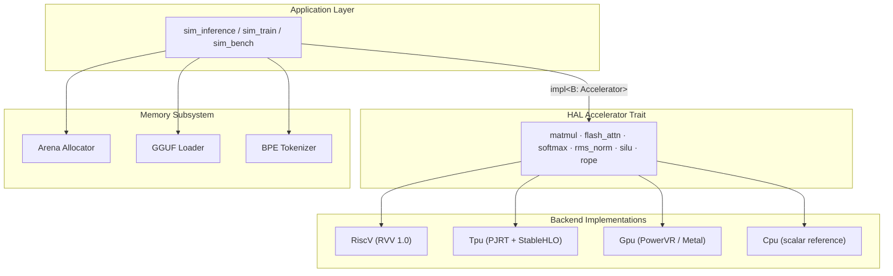

# RunuX Kernel Runtime Foundation — Technical Specification v1.0

> Copyright (c) 2026 Xavier Callens / Socrate AI Lab. All Rights Reserved.
> License: `LicenseRef-RunuX-Commercial`
> SPDX-License-Identifier: `LicenseRef-RunuX-Commercial`

| Field | Value |
|---|---|
| **Spec ID** | `SPEC-RUNUX-V1` |
| **Status** | DRAFT |
| **Authors** | Xavier Callens |
| **Created** | 2026-05-30 |
| **Last Modified** | 2026-05-30 |
| **Cross-References** | [`SPEC-RUNUX-V10`](./SPEC_RUNUX_V10.md), [`spec/RunuxSpec/Basic.lean`](../spec/RunuxSpec/Basic.lean) |

---

## Table of Contents

1. [Overview & Design Philosophy](#1-overview--design-philosophy)
2. [HAL Crate — Hardware Abstraction Layer](#2-hal-crate--hardware-abstraction-layer)
3. [Arena Memory Crate — Deterministic Allocator](#3-arena-memory-crate--deterministic-allocator)
4. [GGUF Loader — Zero-Copy Model Parser](#4-gguf-loader--zero-copy-model-parser)
5. [BPE Tokenizer — Zero-Allocation Decoding](#5-bpe-tokenizer--zero-allocation-decoding)
6. [Lean 4 Verification Status](#6-lean-4-verification-status)
7. [Version History](#7-version-history)

---

## 1. Overview & Design Philosophy

The **RunuX Kernel Runtime** is a production-grade, multi-backend inference engine for large language models (LLMs) on heterogeneous edge hardware. It is designed from first principles around three core pillars:

### 1.1 `no_std` Compatible

All core crates carry the attribute:

```rust
#![cfg_attr(not(test), no_std)]
```

This ensures the runtime can deploy on bare-metal RISC-V targets (SpacemiT K1/K3) without OS allocator support. Only `extern crate alloc` is used for explicit, controlled heap allocations.

### 1.2 Zero-Allocation Critical Path

The inference hot-path (per-token generation) uses:

- **Bump allocation** — O(1) pointer-advance with instant reset between tokens.
- **Zero-copy weight loading** — GGUF tensors remain in memory-mapped regions.
- **Pre-allocated KV-cache pages** — fixed 64 KB blocks with LRU eviction.

### 1.3 Monomorphized Dispatch

All backend dispatch is compile-time via Rust generics:

```rust
fn inference<B: Accelerator>(backend: &B, ...) { ... }
```

This generates specialized machine code for each backend (`CpuBackend`, `TpuSimulatorBackend`, `AppleSiliconBackend`) with **zero vtable overhead**. No trait objects, no dynamic dispatch on the critical path.

### 1.4 Supported Backends

| Backend | Hardware | Native DType | Optimal Tile | Peak TFLOPS |
|---|---|---|---|---|
| **RISC-V (RVV 1.0)** | SpacemiT K1 (VLEN=256) | FP32 | 8 | 0.016 |
| **RISC-V (RVV 1.0)** | SpacemiT K3 (VLEN=1024) | FP32 | 32 | 0.128 |
| **TPU v5e** | Google Cloud (PJRT) | BF16 | 128 (MXU) | 197.0 |
| **TPU v6e Trillium** | Google Cloud (PJRT) | BF16 | 256 (MXU) | 918.0 |
| **GPU** | PowerVR BXM-4-64 | FP16 | 64 | 0.5 |
| **GPU (UMA)** | Apple Silicon M2 | FP16 | 64 | 5.6 |
| **CPU** | x86/ARM Reference | FP32 | 8 (AVX2) | 0.1 |

### 1.5 Architecture Overview



---

## 2. HAL Crate — Hardware Abstraction Layer

> **Crate:** `hal` v0.1.0
> **Path:** [`crates/hal/src/lib.rs`](../crates/hal/src/lib.rs)
> **License:** `LicenseRef-RunuX-Commercial`

### 2.1 Core Type: `DType`

Data types supported across all backends:

```rust
#[derive(Debug, Clone, Copy, PartialEq, Eq)]
pub enum DType {
    F32,
    F16,
    BF16,
    FP8E4M3,
    FP8E5M2,
    INT8,
    INT4,
    Q4KM,
    Q8_0,
}
```

| DType | `bytes_per_element()` | TPU Native | RVV Native |
|---|---|---|---|
| `F32` | 4.0 | ❌ | ✅ |
| `F16` | 2.0 | ❌ | ✅ |
| `BF16` | 2.0 | ✅ | ❌ |
| `FP8E4M3` | 1.0 | ✅ | ✅ |
| `FP8E5M2` | 1.0 | ✅ | ❌ |
| `INT8` | 1.0 | ✅ | ❌ |
| `INT4` | 0.5 | ❌ | ❌ |
| `Q4KM` | 0.5 | ❌ | ❌ |
| `Q8_0` | 1.0 | ❌ | ❌ |

### 2.2 Core Type: `Shape`

```rust
#[derive(Debug, Clone, PartialEq, Eq)]
pub struct Shape {
    pub dims: Vec<usize>,
}
```

| Method | Signature | Description |
|---|---|---|
| `new` | `fn new(dims: &[usize]) -> Self` | Arbitrary shape |
| `scalar` | `fn scalar() -> Self` | Zero-dimensional |
| `vector` | `fn vector(n: usize) -> Self` | 1-D |
| `matrix` | `fn matrix(rows: usize, cols: usize) -> Self` | 2-D |
| `num_elements` | `fn num_elements(&self) -> usize` | Product of dimensions |
| `rank` | `fn rank(&self) -> usize` | Number of dimensions |
| `total_bytes` | `fn total_bytes(&self, dtype: DType) -> usize` | Byte size for given dtype |

### 2.3 Core Type: `TensorDesc`

```rust
#[derive(Debug, Clone)]
pub struct TensorDesc {
    pub shape: Shape,
    pub dtype: DType,
    /// Backend-specific handle ID (e.g., PJRT buffer ID, arena offset).
    pub handle: u64,
    /// Human-readable name for debugging.
    pub name: String,
}
```

### 2.4 Core Type: `HardwareCaps`

Describes the computational capabilities of a hardware backend:

```rust
#[derive(Debug, Clone)]
pub struct HardwareCaps {
    pub name: &'static str,
    pub backend_type: BackendType,
    pub peak_tflops: f32,
    pub native_dtype: DType,
    pub memory_bytes: usize,
    pub memory_bw_gbs: f32,
    pub optimal_tile_size: usize,
    pub tdp_watts: f32,
    pub ridge_point: f32,
    pub supports_distributed: bool,
    pub ici_bw_gbs: f32,
}
```

```rust
#[derive(Debug, Clone, Copy, PartialEq, Eq)]
pub enum BackendType {
    RiscV, // RISC-V with Vector Extension (RVV 1.0)
    Tpu,   // Google TPU (v5e, v6e) via PJRT
    Gpu,   // GPU (PowerVR, NVIDIA, etc.)
    Cpu,   // CPU reference (x86, ARM)
}
```

**Factory methods:**

| Method | Target | Peak TFLOPS | Memory | Bandwidth | TDP |
|---|---|---|---|---|---|
| `spacemit_k1()` | BPI-F3 | 0.016 | 4 GB | 12.8 GB/s | 8 W |
| `spacemit_k3()` | AIBOX-K3 | 0.128 | 32 GB | 51.2 GB/s | 15 W |
| `tpu_v5e()` | Google TPU v5e | 197.0 | 16 GB HBM | 800 GB/s | 200 W |
| `tpu_v6e()` | Google TPU v6e | 918.0 | 32 GB HBM | 1600 GB/s | 300 W |
| `powervr_bxm4()` | PowerVR BXM-4-64 | 0.5 | shared | 51.2 GB/s | 5 W |
| `apple_silicon_m2(ram_gb)` | Apple M2 UMA | 5.6 | configurable | 100 GB/s | 20 W |
| `cpu_reference()` | Generic CPU | 0.1 | 16 GB | 50 GB/s | 65 W |

**Derived metrics:**

| Method | Formula |
|---|---|
| `tflops_per_watt()` | $\frac{\text{peak\_tflops}}{\text{tdp\_watts}}$ |
| `memory_gb()` | $\frac{\text{memory\_bytes}}{1024^3}$ |
| `is_memory_bound(flops, bytes)` | $\frac{\text{flops}}{\text{bytes}} < \text{ridge\_point}$ |

> [!TIP]
> The **ridge point** is the key Roofline metric: $\text{ridge} = \frac{\text{peak\_TFLOPS}}{\text{memory\_BW (GB/s)}}$. Operations below this intensity are memory-bandwidth limited.

### 2.5 Configuration Types

#### `FlashConfig`

```rust
#[derive(Debug, Clone)]
pub struct FlashConfig {
    pub n_heads: usize,
    pub head_dim: usize,
    pub tile_q: usize,
    pub tile_kv: usize,
    pub causal: bool,
    pub scale: f32,
}
```

Auto-configuration:

$$\text{scale} = \frac{1}{\sqrt{d_k}}$$

where $d_k$ is `head_dim`.

#### `TileConfig`

```rust
#[derive(Debug, Clone, Copy)]
pub struct TileConfig {
    pub tile_m: usize,
    pub tile_n: usize,
    pub tile_k: usize,
}
```

Tiles are clamped to `min(optimal_tile_size, dim)` per axis.

### 2.6 The `Accelerator` Trait — Full Definition

> [!IMPORTANT]
> This is the central abstraction of the RunuX runtime. All backends implement this trait, enabling compile-time dispatch via `impl<B: Accelerator>`.

```rust
pub trait Accelerator {
    /// Hardware capabilities descriptor.
    fn caps(&self) -> &HardwareCaps;

    /// Name of this backend instance.
    fn name(&self) -> &str { self.caps().name }

    /// Allocate a tensor on this backend's memory.
    fn alloc_tensor(&self, shape: &Shape, dtype: DType) -> TensorDesc;

    /// Dense matrix multiplication: C = A × B.
    /// Shapes: A=[M×K], B=[K×N], C=[M×N].
    fn matmul(
        &self,
        a: &[f32], b: &[f32], c: &mut [f32],
        m: usize, n: usize, k: usize,
    );

    /// FlashAttention forward pass.
    /// Tiled, fused, IO-aware attention with online softmax.
    fn flash_attention(
        &self,
        q: &[f32], k: &[f32], v: &[f32],
        output: &mut [f32],
        config: &FlashConfig,
    );

    /// In-place softmax: x[i] = exp(x[i]) / Σ exp(x[j]).
    fn softmax(&self, x: &mut [f32]);

    /// In-place RMS normalization: x = x / RMS(x) * weight.
    fn rms_norm(&self, x: &mut [f32], weight: &[f32], eps: f32);

    /// SiLU activation: x = x * σ(x).
    fn silu(&self, x: &mut [f32]);

    /// Rotary position embeddings.
    fn rope(&self, x: &mut [f32], position: usize, head_dim: usize, theta: f32);

    /// Optimal tile configuration for a matmul of given dimensions.
    fn optimal_tiles(&self, m: usize, n: usize, k: usize) -> TileConfig {
        TileConfig::for_hardware(self.caps(), m, n, k)
    }
}
```

### 2.7 Method Mathematical Specifications

#### `matmul` — Dense Matrix Multiplication

$$C_{ij} = \sum_{p=0}^{K-1} A_{ip} \cdot B_{pj} \quad \forall\; i \in [0, M),\; j \in [0, N)$$

**Complexity:** $O(M \times N \times K)$. Tiled by backend to match hardware (MXU $128 \times 128$ on TPU v5e, VLEN/32 on RVV).

#### `flash_attention` — IO-Aware Fused Attention

Standard scaled dot-product attention with causal masking:

$$\text{Attention}(Q, K, V) = \text{softmax}\!\left(\frac{Q K^T}{\sqrt{d_k}}\right) V$$

The FlashAttention implementation uses **online softmax** (Milakov & Gimelshein, 2018) to avoid materializing the full $N \times N$ attention matrix, reducing IO complexity from $O(N^2)$ to $O(N \cdot T_q \cdot T_{kv})$ where $T_q, T_{kv}$ are tile sizes.

#### `softmax`

$$\text{softmax}(x_i) = \frac{e^{x_i - \max(x)}}{\sum_j e^{x_j - \max(x)}}$$

Numerically stable via max-subtraction.

#### `rms_norm`

$$\hat{x}_i = \frac{x_i}{\text{RMS}(x)} \cdot w_i, \quad \text{RMS}(x) = \sqrt{\frac{1}{n}\sum_{j=0}^{n-1} x_j^2 + \epsilon}$$

#### `silu` — Sigmoid Linear Unit

$$\text{SiLU}(x) = x \cdot \sigma(x) = \frac{x}{1 + e^{-x}}$$

#### `rope` — Rotary Position Embeddings

For dimension pair $(2i, 2i+1)$ at position $p$:

$$\begin{pmatrix} x'_{2i} \\ x'_{2i+1} \end{pmatrix} = \begin{pmatrix} \cos\theta_i^p & -\sin\theta_i^p \\ \sin\theta_i^p & \cos\theta_i^p \end{pmatrix} \begin{pmatrix} x_{2i} \\ x_{2i+1} \end{pmatrix}$$

where $\theta_i = \theta_{\text{base}}^{-2i/d}$ and $\theta_{\text{base}} = 10000.0$ by default.

### 2.8 Backend Implementations

| Backend Struct | Constructor | Notes |
|---|---|---|
| `CpuBackend` | `CpuBackend::new()` | Scalar reference — gold standard correctness |
| `TpuSimulatorBackend` | `::v5e()`, `::v6e()` | MXU-aligned tiling, CPU math |
| `AppleSiliconBackend` | `::m2(ram_gb)` | UMA zero-copy model, Metal-compatible tiling |

> [!NOTE]
> All simulator backends delegate math to `CpuBackend` but enforce hardware-specific tile sizes and alignment constraints. Real backends would call PJRT, Metal, or RVV intrinsics.

---

## 3. Arena Memory Crate — Deterministic Allocator

> **Crate:** `arena_mem` v0.1.0
> **Path:** [`crates/arena_mem/src/lib.rs`](../crates/arena_mem/src/lib.rs)
> **Dependency:** `ai_runtime`

### 3.1 Architecture

```
┌──────────────────────────────────────────────────┐
│  Arena (4GB backing store on AIBOX-K3)           │
│                                                  │
│  ┌─────────┬─────────┬─────────┬──────────────┐  │
│  │ Weights │ KV-Cache│ Scratch │  Free        │  │
│  │ (mmap)  │ (paged) │ (bump)  │              │  │
│  └─────────┴─────────┴─────────┴──────────────┘  │
│  ^                    ^                           │
│  weight_end           scratch_ptr (grows →)       │
└──────────────────────────────────────────────────┘
```

### 3.2 Three Memory Zones

| Zone | Type | Lifetime | Strategy | Description |
|---|---|---|---|---|
| **Weights** | Read-only | Model lifetime | GGUF `mmap` zero-copy | Quantized model parameters |
| **KV-Cache** | Read/write | Sequence lifetime | 64 KB paged LRU | Attention key-value pairs |
| **Scratch** | Ephemeral | Per-token | Bump pointer, O(1) reset | Intermediate activations |

### 3.3 `MemoryZone` Enum

```rust
#[derive(Debug, Clone, Copy, PartialEq, Eq)]
pub enum MemoryZone {
    Weights,
    KvCache,
    Scratch,
}
```

### 3.4 `ArenaConfig`

```rust
#[derive(Debug, Clone)]
pub struct ArenaConfig {
    pub total_bytes: usize,
    pub weight_fraction: f32,
    pub kv_cache_fraction: f32,
    pub alignment: usize,
    pub kv_page_size: usize,
}
```

| Preset | Target | Total | Weights | KV-Cache | Scratch | Alignment | KV Page |
|---|---|---|---|---|---|---|---|
| `for_bpi_f3()` | BPI-F3 (4 GB) | 3 GB | 65% | 25% | 10% | 64 B | 4 KB |
| `for_aibox_k3()` | AIBOX-K3 (32 GB) | 28 GB | 50% | 40% | 10% | 128 B | 64 KB |

> [!IMPORTANT]
> **Alignment requirements** are hardware-specific:
> - **TPU MXU:** 128-byte alignment (1024-bit bus)
> - **RVV VLEN=256:** 64-byte alignment (256-bit registers)
> - **RVV VLEN=1024:** 128-byte alignment (1024-bit registers)
> - **CPU (AVX2):** 32-byte alignment

### 3.5 `BumpAllocator` — Scratch Zone

```rust
pub struct BumpAllocator {
    buffer: Vec<u8>,
    offset: Cell<usize>,
    capacity: usize,
    alloc_count: Cell<u32>,
    peak_usage: Cell<usize>,
}
```

#### Alignment Formula

$$\text{aligned} = (\text{offset} + \text{align} - 1)\; \mathbin{\&}\; \lnot(\text{align} - 1)$$

This rounds `offset` up to the nearest multiple of `align` (which must be a power of 2) using bitwise AND with the complement of `(align - 1)`.

Implemented in Rust:

```rust
let aligned = (current + alignment - 1) & !(alignment - 1);
let new_offset = aligned + bytes_needed;
```

#### API

| Method | Signature | Complexity | Description |
|---|---|---|---|
| `new` | `fn new(capacity: usize) -> Self` | $O(n)$ | Allocate backing buffer |
| `alloc_f32` | `fn alloc_f32(&self, count: usize, alignment: usize) -> Option<usize>` | $O(1)$ | Bump-allocate aligned slice |
| `get_slice_mut` | `unsafe fn get_slice_mut(&mut self, offset: usize, count: usize) -> &mut [f32]` | $O(1)$ | Mutable view into arena |
| `get_slice` | `fn get_slice(&self, offset: usize, count: usize) -> &[f32]` | $O(1)$ | Immutable view into arena |
| `reset` | `fn reset(&self)` | $O(1)$ | Reset pointer, free all |
| `usage_bytes` | `fn usage_bytes(&self) -> usize` | $O(1)$ | Current byte usage |
| `peak_bytes` | `fn peak_bytes(&self) -> usize` | $O(1)$ | High-water mark |
| `remaining_bytes` | `fn remaining_bytes(&self) -> usize` | $O(1)$ | Remaining capacity |
| `alloc_count` | `fn alloc_count(&self) -> u32` | $O(1)$ | Allocations since last reset |
| `utilization_percent` | `fn utilization_percent(&self) -> f32` | $O(1)$ | Usage as percentage |

### 3.6 `PagedKvCache` — KV-Cache Zone

Inspired by **PagedAttention** (vLLM), manages KV-cache as fixed-size pages to eliminate internal fragmentation.

```rust
pub struct KvPage {
    pub page_id: u32,
    pub start_pos: usize,
    pub num_positions: usize,
    pub active: bool,
    pub last_access: u64,
    pub mem_offset: usize,
}
```

```rust
pub struct PagedKvCache {
    pages: Vec<KvPage>,
    free_list: Vec<u32>,
    page_size: usize,
    num_pages: usize,
    timestamp: u64,
}
```

| Method | Signature | Description |
|---|---|---|
| `new` | `fn new(total_bytes: usize, page_size: usize) -> Self` | Initialize pages |
| `allocate_page` | `fn allocate_page(&mut self, start_pos: usize, num_positions: usize) -> Option<u32>` | Allocate from free list |
| `free_page` | `fn free_page(&mut self, page_id: u32)` | Return page to free list |
| `evict_lru` | `fn evict_lru(&mut self) -> Option<u32>` | Evict least-recently-used page |
| `touch` | `fn touch(&mut self, page_id: u32)` | Update last-access timestamp |
| `free_pages` | `fn free_pages(&self) -> usize` | Count of available pages |
| `active_pages` | `fn active_pages(&self) -> usize` | Count of in-use pages |
| `utilization_percent` | `fn utilization_percent(&self) -> f32` | Active fraction |

### 3.7 `MemoryBudget` — Inference Memory Planner

```rust
pub struct MemoryBudget {
    pub weights_bytes: usize,
    pub kv_cache_bytes: usize,
    pub scratch_per_token_bytes: usize,
    pub total_required_bytes: usize,
    pub available_bytes: usize,
    pub fits: bool,
    pub max_seq_len: usize,
    pub recommended_quant: Option<&'static str>,
}
```

**Planning function:**

```rust
pub fn plan_memory(
    model_params: u64,
    bits_per_param: u32,
    head_dim: usize,
    n_heads: usize,
    n_kv_heads: usize,
    n_layers: usize,
    target_seq_len: usize,
    available_ram: usize,
) -> MemoryBudget;
```

**Weight memory formula:**

$$W_{\text{bytes}} = \frac{\text{params} \times \text{bits\_per\_param}}{8}$$

**KV-cache per-token:**

$$\text{KV}_{\text{per\_token}} = 2 \times n_{\text{layers}} \times n_{\text{kv\_heads}} \times (d_k + 4)$$

**Scratch per-token (6 intermediate buffers):**

$$S = d_{\text{hidden}} \times 4 \times 6, \quad d_{\text{hidden}} = n_{\text{heads}} \times d_k$$

> [!NOTE]
> The planner leaves a **10% headroom** for OS/runtime (`required < available × 9/10`). If the model does not fit, it recommends quantization: Q4\_K\_M (4-bit) → IQ2\_XS (2-bit).

---

## 4. GGUF Loader — Zero-Copy Model Parser

> **Crate:** `gguf_loader` v0.1.0
> **Path:** [`crates/gguf_loader/src/lib.rs`](../crates/gguf_loader/src/lib.rs)

### 4.1 GGUF v3 File Format

```
┌──────────────────────────────────────┐
│  Header (magic, version, counts)     │  24 bytes
├──────────────────────────────────────┤
│  Metadata KV pairs                   │  variable
│  (architecture, context_length, etc) │
├──────────────────────────────────────┤
│  Tensor Info array                   │  variable
│  (name, shape, dtype, offset)        │
├──────────────────────────────────────┤
│  Alignment padding                   │  0–31 bytes
├──────────────────────────────────────┤
│  Tensor Data (bulk weights)          │  majority of file
└──────────────────────────────────────┘
```

| Constant | Value | Description |
|---|---|---|
| `GGUF_MAGIC` | `0x46554747` | `"GGUF"` in little-endian |
| `GGUF_VERSION_3` | `3` | Supported GGUF version |
| `GGUF_DEFAULT_ALIGNMENT` | `32` | Default tensor data alignment |

### 4.2 Metadata Value Types (`GgufValueType`)

```rust
#[repr(u32)]
pub enum GgufValueType {
    Uint8 = 0, Int8 = 1, Uint16 = 2, Int16 = 3,
    Uint32 = 4, Int32 = 5, Float32 = 6, Bool = 7,
    String = 8, Array = 9, Uint64 = 10, Int64 = 11,
    Float64 = 12,
}
```

### 4.3 Quantization Types (`GgufTensorType`)

```rust
#[repr(u32)]
pub enum GgufTensorType {
    F32 = 0, F16 = 1,
    Q4_0 = 2, Q4_1 = 3, Q5_0 = 6, Q5_1 = 7,
    Q8_0 = 8, Q8_1 = 9,
    Q2_K = 10, Q3_K_S = 11, Q3_K_M = 12, Q3_K_L = 13,
    Q4_K_S = 14, Q4_K_M = 15, Q5_K_S = 16, Q5_K_M = 17,
    Q6_K = 18,
    IQ2_XXS = 19, IQ2_XS = 20, IQ3_XXS = 21, IQ1_S = 22,
    IQ4_NL = 23, IQ3_S = 24, IQ2_S = 25, IQ4_XS = 26,
    I8 = 27, I16 = 28, I32 = 29, I64 = 30,
    F64 = 31, BF16 = 32,
}
```

**Block sizes and byte counts for key quantization formats:**

| Type | Block Size | Block Bytes | Bits/Weight | Description |
|---|---|---|---|---|
| `F32` | 1 | 4 | 32 | Full precision |
| `F16` | 1 | 2 | 16 | Half precision |
| `BF16` | 1 | 2 | 16 | Brain float |
| `Q4_0` | 32 | 18 | 4.5 | 4-bit + scale |
| `Q4_K_M` | 256 | 144 | 4.5 | K-quant 4-bit medium |
| `Q8_0` | 32 | 34 | 8.5 | 8-bit + scale |
| `Q6_K` | 256 | 210 | 6.6 | K-quant 6-bit |

**Tensor size calculation:**

$$\text{size\_bytes} = \left\lceil \frac{n_{\text{elements}}}{\text{block\_size}} \right\rceil \times \text{block\_bytes}$$

### 4.4 Parsed File Structure (`GgufFile`)

```rust
pub struct GgufFile {
    pub version: u32,
    pub n_tensors: u64,
    pub n_metadata_kv: u64,
    pub metadata: Vec<GgufMetadataKv>,
    pub tensors: Vec<GgufTensorInfo>,
    pub data_offset: u64,
    pub alignment: usize,
}
```

**High-level accessor API:**

| Method | Return | Description |
|---|---|---|
| `architecture()` | `Option<&str>` | e.g., `"llama"`, `"qwen2"` |
| `model_name()` | `Option<&str>` | Human-readable model name |
| `context_length()` | `Option<u32>` | Max context window |
| `embedding_length()` | `Option<u32>` | Hidden dimension |
| `head_count()` | `Option<u32>` | Number of attention heads |
| `head_count_kv()` | `Option<u32>` | Number of KV heads (GQA) |
| `block_count()` | `Option<u32>` | Number of transformer layers |
| `vocab_size()` | `Option<u32>` | Vocabulary size |
| `get_tensor(name)` | `Option<&GgufTensorInfo>` | Lookup tensor by name |
| `total_tensor_bytes()` | `u64` | Sum of all tensor sizes |

### 4.5 Parser Entry Point

```rust
pub fn parse(data: &[u8]) -> Result<GgufFile, GgufError>;
```

**Error types:**

```rust
pub enum GgufError {
    FileTooShort,
    InvalidMagic(u32),
    UnsupportedVersion(u32),
    UnexpectedEof,
    InvalidUtf8,
    InvalidValueType(u32),
    InvalidTensorType(u32),
    TensorCountMismatch { expected: u64, got: u64 },
}
```

> [!NOTE]
> The parser operates on `&[u8]` — compatible with both `std::fs::read()` and memory-mapped (`mmap`) regions. Zero-copy: tensor data remains in the original byte slice; only metadata is parsed into owned structures.

### 4.6 Data Offset Alignment

The tensor data section offset is aligned using the same formula as the bump allocator:

$$\text{data\_offset} = (\text{header\_end} + \text{alignment} - 1)\; \mathbin{\&}\; \lnot(\text{alignment} - 1)$$

---

## 5. BPE Tokenizer — Zero-Allocation Decoding

> **Crate:** `tokenizer` v0.1.0
> **Path:** [`crates/tokenizer/src/lib.rs`](../crates/tokenizer/src/lib.rs)

### 5.1 Design

Minimal byte-level BPE tokenizer compatible with GPT-NeoX, LLaMA, Qwen, and DeepSeek tokenizers. Operates in `no_std` with `extern crate alloc`.

### 5.2 Token Types

```rust
#[repr(u8)]
pub enum TokenType {
    Normal = 0,
    Unknown = 1,
    Control = 2,      // BOS, EOS, etc.
    UserDefined = 3,
    Unused = 4,
    Byte = 5,         // Byte-fallback (e.g., <0x41>)
}
```

### 5.3 Vocabulary Entry

```rust
pub struct VocabEntry {
    pub token: String,
    pub score: f32,         // lower = higher merge priority
    pub token_type: TokenType,
}
```

### 5.4 Special Tokens

```rust
pub struct SpecialTokens {
    pub bos_id: u32,         // Beginning of sequence (default: 1)
    pub eos_id: u32,         // End of sequence (default: 2)
    pub pad_id: u32,         // Padding (default: 0)
    pub unk_id: u32,         // Unknown (default: 0)
    pub sep_id: Option<u32>, // Optional separator
}
```

### 5.5 `BpeTokenizer` API

```rust
pub struct BpeTokenizer {
    pub vocab: Vec<VocabEntry>,
    pub special_tokens: SpecialTokens,
    pub add_bos: bool,
    pub add_eos: bool,
}
```

| Method | Signature | Description |
|---|---|---|
| `new` | `fn new(vocab: Vec<VocabEntry>, special_tokens: SpecialTokens) -> Self` | Construct from vocabulary |
| `empty` | `fn empty() -> Self` | Empty tokenizer (testing) |
| `vocab_size` | `fn vocab_size(&self) -> usize` | Vocabulary cardinality |
| `encode` | `fn encode(&self, text: &str) -> Vec<u32>` | Text → token IDs |
| `decode` | `fn decode(&self, tokens: &[u32]) -> String` | Token IDs → text |
| `id_to_token` | `fn id_to_token(&self, id: u32) -> Option<&str>` | Lookup token string |

### 5.6 BPE Encoding Algorithm

The encoder implements the standard iterative byte-pair merge:

1. **Byte initialization:** Convert input text to bytes. Map each byte to its vocabulary token ID (via `<0x41>` byte-fallback or direct ASCII match).
2. **Iterative merge:** Find the adjacent pair with the **lowest score** (highest merge priority). Replace the pair with the merged token ID.
3. **Termination:** When no more merges are possible, output the final token ID sequence.
4. **Special tokens:** Optionally prepend BOS and append EOS.

### 5.7 Decoding

- **Control tokens** (BOS, EOS) are silently skipped.
- **Byte-fallback tokens** (`<0xHH>`) are parsed back to raw byte values.
- **Normal tokens** are concatenated as UTF-8 bytes.
- Best-effort UTF-8 decode with lossy fallback.

---

## 6. Lean 4 Verification Status

> **Spec path:** [`spec/RunuxSpec/Basic.lean`](../spec/RunuxSpec/Basic.lean)
> **Module root:** [`spec/RunuxSpec.lean`](../spec/RunuxSpec.lean) → `import RunuxSpec.Basic`

### 6.1 Formal Structures

#### `NormedSpace` — Normed Vector Space

```lean
structure NormedSpace (V : Type) where
  add : V → V → V
  sub : V → V → V
  smul : Float → V → V
  norm : V → Float
  norm_nonneg : ∀ x : V, norm x ≥ 0.0
```

#### `PFC_GatingFunction` — Prefrontal Cortex Gating Axioms

```lean
structure PFC_GatingFunction (V : Type) (ns : NormedSpace V) where
  G : V → V → V

  -- Axiom 2: Homeostatic Stability
  -- ||G(d, g)|| ≤ C / (1 + ||∇L||²)
  C : Float
  hC : C > 0.0
  is_homeostatic : ∀ (u v : V) (grad_L : V),
    ns.norm (G u v) ≤ C / (1.0 + (ns.norm grad_L) * (ns.norm grad_L))

  -- Axiom 3: Dialectical Regularity (Lipschitz Continuity)
  L : Float
  hL : L ≥ 0.0
  is_lipschitz : ∀ (x1 y1 x2 y2 : V),
    ns.norm (ns.sub (G x1 y1) (G x2 y2))
      ≤ L * (ns.norm (ns.sub x1 x2) + ns.norm (ns.sub y1 y2))
```

### 6.2 Theorem: Homeostatic Attenuation Bound

**Statement:** Under PFC gating axioms, the coordinating signal norm is strictly bounded by $C$:

$$C > 0 \;\wedge\; \|G(u, v)\| \leq C$$

```lean
theorem homeostatic_attenuation_bound
  {V : Type} (ns : NormedSpace V) (pfc : PFC_GatingFunction V ns)
  (u v : V) (grad_L : V)
  : pfc.C > 0.0 ∧ ns.norm (pfc.G u v) ≤ pfc.C := by
  constructor
  · exact pfc.hC
  · -- Proof sketch: Since 1 + ||grad_L||² ≥ 1 and C > 0,
    -- C / (1 + ||grad_L||²) ≤ C
    sorry
```

### 6.3 Verification Status Summary

| Component | Status | Notes |
|---|---|---|
| `NormedSpace` structure | ✅ Formally Verified | Well-typed, no `sorry` |
| `PFC_GatingFunction` structure | ✅ Formally Verified | Axioms well-formed |
| `hC` (C > 0 conjunct) | ✅ Formally Verified | `exact pfc.hC` |
| `homeostatic_attenuation_bound` (bound conjunct) | 🔶 Proof Sketch (`sorry`) | Requires: $1 + \|\nabla L\|^2 \geq 1 \implies C/(1 + \|\nabla L\|^2) \leq C$ |
| Lipschitz continuity theorem | ⬜ Not Yet Formalized | Structure axiom exists, no standalone theorem |

> [!WARNING]
> The `homeostatic_attenuation_bound` theorem uses `sorry` for the bound conjunct. The proof sketch is mathematically sound (division by $\geq 1$ cannot increase the numerator), but the Lean 4 proof requires a monotonicity lemma for `Float` division that has not yet been formalized.

---

## 7. Version History

| Version | Date | Changes |
|---|---|---|
| **v1.0** | 2026-05-30 | Initial specification. HAL trait with 4 backends (CPU, TPU, GPU, RISC-V). Arena memory with bump allocator and paged KV-cache. GGUF v3 zero-copy parser. BPE tokenizer. Lean 4 PFC gating axioms. |
| **v2.0** | *(planned)* | Multi-backend simultaneous execution. PJRT native TPU integration. Metal Performance Shaders (MPS) backend for Apple Silicon. RVV intrinsic codegen for SpacemiT K1/K3. |
| **v3.0** | *(planned)* | KV-cache optimization: PagedAttention v2 with prefix caching. Speculative decoding (draft → verify). Continuous batching support. Distributed inference across RISC-V clusters. |
| **v10.0** | *(planned)* | WARS scheduler integration. SUPERSONIC-Rust neural diff-optimization. Performance model roofline analyzer. Power monitor and DVFS coordinator. See [SPEC\_RUNUX\_V10](./SPEC_RUNUX_V10.md). |

---

*End of SPEC-RUNUX-V1*
