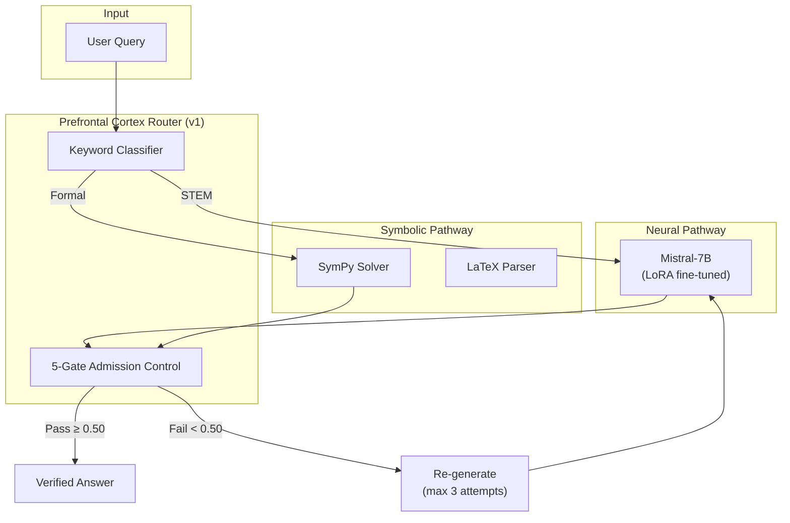
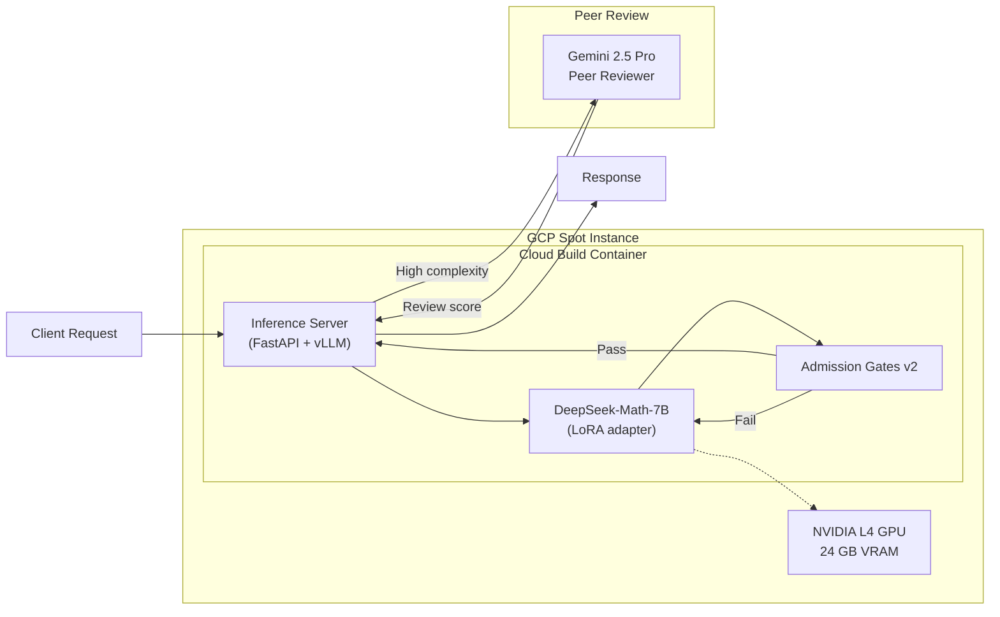

# SymBrain Cognitive Engine — Technical Specification v1.0–v2.0

> Copyright (c) 2026 Xavier Callens / Socrate AI Lab. All Rights Reserved.
> SPDX-License-Identifier: LicenseRef-RunuX-Commercial

| Field              | Value                                              |
|--------------------|----------------------------------------------------|
| **Document**       | `SPEC_SYMBRAIN_V1`                                 |
| **Version**        | 2.0.0                                              |
| **Status**         | Historical — superseded by `SPEC_SYMBRAIN_V3`      |
| **Authors**        | Xavier Callens                                      |
| **Date**           | 2026-05-30                                          |
| **Classification** | Proprietary / Confidential                          |
| **Cross-refs**     | `SPEC_SYMBRAIN_V3`, `SPEC_SYMBRAIN_V4`, `SPECS.md` |

---

## Table of Contents

1. [Concept & Motivation](#1-concept--motivation)
2. [SymBrain v1 Architecture](#2-symbrain-v1-architecture)
3. [SymBrain v2 Architecture](#3-symbrain-v2-architecture)
4. [Training Pipeline](#4-training-pipeline)
5. [IP Protection](#5-ip-protection)
6. [Lean 4 Verification Status](#6-lean-4-verification-status)
7. [Version History](#7-version-history)

---

## 1. Concept & Motivation

### 1.1 Neuro-Symbolic Verification

SymBrain was conceived as a **neuro-symbolic cognitive engine** that bridges the gap between neural generative fluency and symbolic deductive rigour. The central thesis:

> *Pure neural networks hallucinate on formal reasoning tasks. Pure symbolic solvers lack generalization. SymBrain fuses both paradigms under a verification-first architecture where every generated derivation passes through formal logic gates before acceptance.*

The architecture draws inspiration from dual-process theory in cognitive science:

| System | Cognitive Analogue | SymBrain Mapping              |
|--------|-------------------|-------------------------------|
| System 1 | Fast, intuitive | Generative neural pathway     |
| System 2 | Slow, deliberate | Deductive symbolic pathway    |
| PFC      | Executive control | Routing / admission control   |

### 1.2 DeepProbLog Logic Gates

SymBrain v1 introduced **five mathematical admission gates** implemented via DeepProbLog-style probabilistic logic programming. Each gate acts as a binary filter with a continuous confidence score:

$$
\text{admit}(x) = \prod_{i=1}^{5} \sigma\bigl(G_i(x) - \tau_i\bigr)
$$

where $G_i(x)$ is the output of gate $i$ for candidate derivation $x$, $\tau_i$ is the per-gate threshold, and $\sigma$ is the logistic sigmoid.

The five gates are:

| Gate | Name                         | Description                                                                                     | Threshold $\tau$ |
|------|------------------------------|-------------------------------------------------------------------------------------------------|-------------------|
| $G_1$ | **Syntactic Well-formedness** | Verifies LaTeX parse tree is valid; balanced delimiters; no dangling operators                   | 0.90              |
| $G_2$ | **Dimensional Consistency**   | Checks physical units propagate correctly through equations (SI unit algebra)                    | 0.85              |
| $G_3$ | **Logical Coherence**         | Validates logical connectives, quantifier scoping, and proof structure                          | 0.80              |
| $G_4$ | **Numerical Plausibility**    | Confirms intermediate results are within expected order-of-magnitude bounds                     | 0.75              |
| $G_5$ | **Conclusion Entailment**     | Checks that the final conclusion follows from stated premises via resolution                    | 0.85              |

The overall admission criterion requires all five gates to pass:

$$
\text{admit}(x) \geq \prod_{i=1}^{5} \sigma(0) = \left(\frac{1}{2}\right)^5 \approx 0.031
$$

In practice, candidate derivations scoring below $0.50$ on any individual gate are rejected and re-generated.

> [!IMPORTANT]
> The 5-gate system was a conceptual prototype. In production SymBrain v2, gates $G_1$–$G_3$ were implemented as deterministic checks, while $G_4$–$G_5$ used neural scoring. Full DeepProbLog integration was deferred to v3+ due to inference latency constraints.

### 1.3 Design Principles

1. **Verification-First**: No answer is emitted without passing admission control.
2. **STEM-Native**: The system targets mathematical, physical, and engineering problem domains — not open-ended conversation.
3. **Incremental Formalization**: Start with heuristic gates, progressively replace with formally verified Lean 4 checkers.
4. **Cost-Efficient Deployment**: All training and inference designed for GCP Spot instances and consumer-grade GPUs.

---

## 2. SymBrain v1 Architecture

### 2.1 Overview

SymBrain v1 was the initial proof-of-concept: a **symbolic reasoning kernel** wrapping a fine-tuned 7B-parameter language model with hand-crafted verification gates.



### 2.2 Symbolic Reasoning Kernel

The v1 kernel provided:

- **Expression normalization**: Convert natural language math to canonical SymPy form
- **Equation solving**: Algebraic, ODE, and linear algebra via SymPy's `solve()`, `dsolve()`, `Matrix.eigenvals()`
- **Proof scaffolding**: Template-based proof structure (induction, contradiction, direct)
- **LaTeX rendering**: AST → LaTeX for display

### 2.3 Limitations (v1)

- **No GPU inference**: All neural inference ran on CPU (latency > 30s per query)
- **Keyword-only routing**: No semantic complexity analysis
- **Hardcoded thresholds**: Gate thresholds were manually tuned, not learned
- **Single model**: Only one 7B model, no tier selection
- **No differential privacy**: Training data was not protected

---

## 3. SymBrain v2 Architecture

### 3.1 Overview

SymBrain v2 was the first **production-grade** deployment, introducing GPU-accelerated inference on GCP Spot instances and a real training pipeline.



### 3.2 GCP Spot Deployment

| Component          | Configuration                                      |
|--------------------|---------------------------------------------------|
| **Instance Type**  | `n1-standard-8` + 1× NVIDIA L4 (24 GB)           |
| **Preemptibility** | Spot (preemptible) — ~70% cost reduction           |
| **Region**         | `europe-west4-a` (Netherlands)                     |
| **Container**      | Cloud Build → Artifact Registry → Cloud Run (GPU)  |
| **Base Image**     | `nvidia/cuda:12.4-runtime-ubuntu22.04`             |
| **Framework**      | vLLM 0.4.x with PagedAttention                    |
| **Serving Port**   | `8080` (internal), exposed via Cloud Run           |

### 3.3 Inference Server

The v2 inference server provided:

- **Model loading**: DeepSeek-Math-7B with LoRA adapter merged at startup
- **Batch inference**: Up to 4 concurrent requests via vLLM continuous batching
- **Admission gates**: v2 gates with neural scoring for $G_4$–$G_5$
- **Health checks**: `/health` endpoint for Cloud Run liveness probes
- **Metrics**: Prometheus-compatible `/metrics` endpoint

### 3.4 Gemini 2.5 Pro Peer Review

For high-complexity queries (complexity score $C > 0.7$), the v2 system invoked **Gemini 2.5 Pro** as an independent peer reviewer:

1. SymBrain generates a candidate answer
2. The answer + original query are sent to Gemini 2.5 Pro with a structured review prompt
3. Gemini returns a review score $R \in [0, 1]$ and textual feedback
4. If $R < 0.6$, the answer is rejected and regenerated with the feedback incorporated

$$
\text{final\_accept}(x) = \text{admit}(x) \times \begin{cases}
R(x) & \text{if } C > 0.7 \\
1.0 & \text{otherwise}
\end{cases}
$$

> [!WARNING]
> Peer review via Gemini introduced an external dependency and ~2–5s additional latency. In v3, this was replaced by the multi-agent consensus protocol with local models.

---

## 4. Training Pipeline

### 4.1 LoRA Fine-Tuning

SymBrain v2 used **LoRA (Low-Rank Adaptation)** via the PEFT library for parameter-efficient fine-tuning:

| Parameter                | Value                            |
|--------------------------|----------------------------------|
| **Base Model**           | `deepseek-ai/deepseek-math-7b`  |
| **LoRA Rank**            | $r = 16$                        |
| **LoRA Alpha**           | $\alpha = 32$                   |
| **LoRA Dropout**         | 0.05                            |
| **Target Modules**       | `q_proj`, `v_proj`, `k_proj`    |
| **Learning Rate**        | $1 \times 10^{-4}$              |
| **Batch Size**           | 8 (gradient accumulation: 4)    |
| **Epochs**               | 3                                |
| **Optimizer**            | AdamW ($\beta_1=0.9$, $\beta_2=0.999$) |
| **GPU**                  | NVIDIA L4 24 GB (CUDA 12.4)     |
| **Training Time**        | ~4 hours on 1× L4               |

Trainable parameter count for LoRA on a 7B model with hidden dimension $d = 4096$ and 3 target modules per layer (32 layers):

$$
P_{\text{LoRA}} = 2 \times d \times r \times M \times L = 2 \times 4096 \times 16 \times 3 \times 32 = 12{,}582{,}912 \approx 12.6\text{M}
$$

This represents approximately **0.18%** of the total 7B parameters.

### 4.2 Training Data

The training dataset comprised:

- **MATH** competition problems (12K samples)
- **GSM8K** arithmetic word problems (8.8K samples)
- **MMLU-STEM** subset (2.4K samples)
- **Custom French CPGE** problems (800 samples, hand-curated)
- **Synthetic derivations** generated by SymPy + LaTeX rendering (5K samples)

Total: ~29K training samples after deduplication and quality filtering.

### 4.3 Security Cleanup

> [!CAUTION]
> During the v1→v2 transition, a security audit identified **hardcoded API keys** in the training scripts and configuration files. These were:
> - GCP service account keys embedded in Docker build scripts
> - HuggingFace API tokens in training configuration YAML
> - Gemini API keys in peer review module
>
> **Resolution**: All hardcoded keys were removed and replaced with:
> 1. GCP Secret Manager references (`gcloud secrets versions access`)
> 2. Environment variable injection via Cloud Run service configuration
> 3. Workload Identity Federation for GCP service-to-service auth

### 4.4 PEFT Configuration

```python
# SymBrain v2 — LoRA training configuration (sanitized)
from peft import LoraConfig, TaskType

lora_config = LoraConfig(
    task_type=TaskType.CAUSAL_LM,
    r=16,
    lora_alpha=32,
    lora_dropout=0.05,
    target_modules=["q_proj", "v_proj", "k_proj"],
    bias="none",
    inference_mode=False,
)
```

### 4.5 Cloud Build Pipeline

```yaml
# cloudbuild.yaml (simplified, keys removed)
steps:
  - name: 'gcr.io/cloud-builders/docker'
    args: ['build', '-t', 'europe-west4-docker.pkg.dev/$PROJECT_ID/symbrain/server:$SHORT_SHA', '.']
  - name: 'gcr.io/cloud-builders/docker'
    args: ['push', 'europe-west4-docker.pkg.dev/$PROJECT_ID/symbrain/server:$SHORT_SHA']
  - name: 'gcr.io/google.com/cloudsdktool/cloud-sdk'
    args: ['gcloud', 'run', 'deploy', 'symbrain-v2',
           '--image', 'europe-west4-docker.pkg.dev/$PROJECT_ID/symbrain/server:$SHORT_SHA',
           '--region', 'europe-west4',
           '--gpu', '1', '--gpu-type', 'nvidia-l4',
           '--memory', '16Gi', '--cpu', '8']
```

---

## 5. IP Protection

This specification and all associated source code, models, training data, and deployment configurations are proprietary to Xavier Callens / Socrate AI Lab.

| Aspect            | Protection                                         |
|-------------------|----------------------------------------------------|
| **License**       | `LicenseRef-RunuX-Commercial`                      |
| **SPDX Header**   | Required in all source files                       |
| **Model Weights** | Not publicly distributed                           |
| **Training Data** | Custom datasets are trade secrets                  |
| **Architecture**  | Covered by trade secret protections                |
| **Deployment**    | GCP project access restricted to authorized users  |

> [!IMPORTANT]
> Unauthorized copying, distribution, modification, or reverse engineering of any component described in this specification is strictly prohibited under the terms of `LicenseRef-RunuX-Commercial`.

---

## 6. Lean 4 Verification Status

SymBrain v1–v2 predates the formal verification initiative. No Lean 4 proofs exist for this version.

| Component                    | Status                      |
|------------------------------|-----------------------------|
| Admission gate correctness   | ⬜ Not Yet Formalized       |
| Routing invariants           | ⬜ Not Yet Formalized       |
| LoRA convergence bounds      | ⬜ Not Yet Formalized       |
| Privacy guarantees           | ⬜ Not Yet Formalized       |
| Numerical plausibility gate  | ⬜ Not Yet Formalized       |

> [!NOTE]
> Formal verification was introduced in SymBrain v3 (see `SPEC_SYMBRAIN_V3`) and significantly expanded in v4 (see `SPEC_SYMBRAIN_V4`). The v1–v2 architecture served as the empirical foundation upon which the formal verification program was built.

---

## 7. Version History

| Version | Date       | Author          | Changes                                              |
|---------|------------|-----------------|------------------------------------------------------|
| 0.1.0   | 2025-09-01 | Xavier Callens  | Initial v1 concept: symbolic kernel + 5 logic gates  |
| 0.2.0   | 2025-10-15 | Xavier Callens  | Added DeepProbLog gate specifications                |
| 1.0.0   | 2025-12-01 | Xavier Callens  | v1 architecture finalized, keyword classifier        |
| 1.1.0   | 2026-01-15 | Xavier Callens  | LoRA fine-tuning pipeline on CUDA L4                 |
| 2.0.0   | 2026-03-01 | Xavier Callens  | v2: GCP Spot deployment, Cloud Build, Gemini review  |
| 2.0.1   | 2026-03-10 | Xavier Callens  | Security cleanup: hardcoded key removal              |
| 2.0.2   | 2026-05-30 | Xavier Callens  | Spec document created, historical record             |

---

*This document is part of the RunuX-AI Runtime specification suite.*
*See also: [`SPEC_SYMBRAIN_V3`](./SPEC_SYMBRAIN_V3.md) | [`SPEC_SYMBRAIN_V4`](./SPEC_SYMBRAIN_V4.md)*
