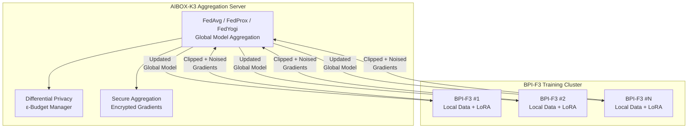
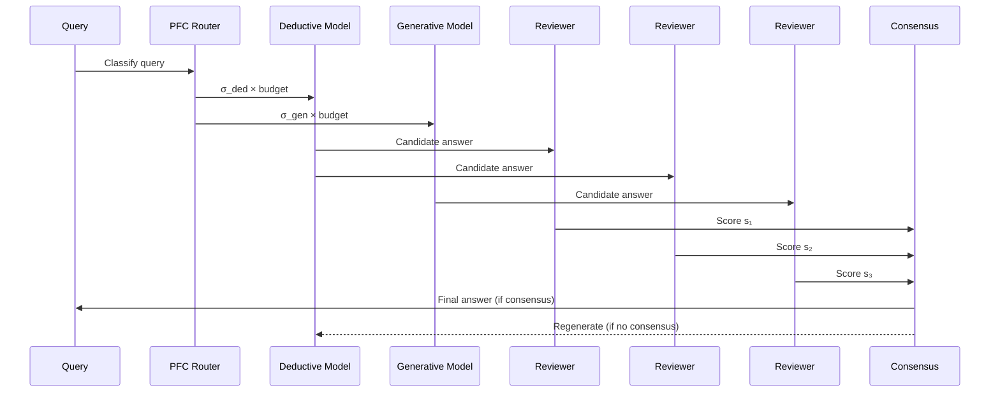

# SymBrain v3 Swarm Bourbaki — Technical Specification

> Copyright (c) 2026 Xavier Callens / Socrate AI Lab. All Rights Reserved.
> SPDX-License-Identifier: LicenseRef-RunuX-Commercial

| Field              | Value                                                          |
|--------------------|----------------------------------------------------------------|
| **Document**       | `SPEC_SYMBRAIN_V3`                                             |
| **Version**        | 3.0.0                                                          |
| **Status**         | Historical — superseded by `SPEC_SYMBRAIN_V4`                  |
| **Authors**        | Xavier Callens                                                  |
| **Date**           | 2026-05-30                                                      |
| **Classification** | Proprietary / Confidential                                      |
| **Cross-refs**     | `SPEC_SYMBRAIN_V1`, `SPEC_SYMBRAIN_V4`, `crates/federated/`, `crates/ai_bridge/` |

---

## Table of Contents

1. [SETI-Fed Volunteer Swarm Protocol](#1-seti-fed-volunteer-swarm-protocol)
2. [Federated Learning Crate (`federated`)](#2-federated-learning-crate-federated)
3. [Edge Co-Inference Engine](#3-edge-co-inference-engine)
4. [AI Bridge (`ai_bridge`)](#4-ai-bridge-ai_bridge)
5. [Serverless Dashboard](#5-serverless-dashboard)
6. [Multi-Agent Peer Reviews](#6-multi-agent-peer-reviews)
7. [Lean 4 Verification](#7-lean-4-verification)
8. [Version History](#8-version-history)

---

## 1. SETI-Fed Volunteer Swarm Protocol

### 1.1 Overview

SymBrain v3 — codenamed **Swarm Bourbaki** — introduces a peer-to-peer volunteer swarm protocol for distributed federated training and inference. Inspired by SETI@home's volunteer computing model, the protocol coordinates heterogeneous edge nodes (RISC-V BPI-F3, AIBOX-K3 clusters) into a unified training swarm.



### 1.2 P2P Coordination

Each node in the swarm is identified by a `NodeId` (u64) and maintains a status lifecycle:

```
Ready → Training → Uploading → Downloading → Ready
                                          ↘ Disconnected → Ready (rejoin)
                                          ↘ Failed (permanent)
```

The cluster requires a **minimum client fraction** of participating nodes per round to proceed:

$$
\frac{|\text{online\_clients}|}{|\text{total\_clients}|} \geq f_{\min} = 0.5
$$

This ensures training progresses even under 50% node dropout — a critical requirement for volunteer swarm deployments where nodes may go offline unpredictably.

### 1.3 Layer Block Sharding

For models exceeding the memory capacity of a single BPI-F3 node (8 GB), the swarm supports **layer block sharding**: different transformer layers are assigned to different nodes, with inter-node communication via dual GbE links.

Estimated cluster compute and RAM from the `FederatedCluster` implementation:

| Platform       | TOPS per node | RAM per node | Typical Role |
|----------------|---------------|--------------|--------------|
| AIBOX-K3       | 60            | 32 GB        | Server       |
| BPI-F3         | 2             | 8 GB         | Client       |
| Generic RISC-V | 1             | 4 GB         | Client       |
| x86 Server     | 1 (fallback)  | 4 GB (min)   | Client       |

A reference cluster of 1× AIBOX-K3 + 2× BPI-F3 yields:

$$
\text{Total TOPS} = 60 + 2 + 2 = 64 \text{ TOPS}
$$
$$
\text{Total RAM} = 32 + 8 + 8 = 48 \text{ GB}
$$

### 1.4 SignSGD Gradient Compression

To reduce bandwidth over the dual GbE links, SymBrain v3 supports **gradient sparsification** with configurable top-$k\%$ retention:

$$
\tilde{g}_i = \begin{cases}
g_i & \text{if } |g_i| \geq \theta_k \\
0   & \text{otherwise}
\end{cases}
$$

where $\theta_k$ is the $k$-th largest gradient magnitude. Combined with SignSGD (1-bit quantization of gradient signs), this achieves up to **32× bandwidth reduction**:

| Compression Method       | Bits/param | Bandwidth Reduction |
|--------------------------|-----------|---------------------|
| Full FP32 gradients      | 32        | 1×                  |
| Top-10% sparsification   | 32 × 0.1 | 10×                 |
| SignSGD (1-bit)          | 1         | 32×                 |
| Top-10% + SignSGD        | 0.1       | 320×                |

The `GradientBuffer::sparsify()` method implements this:

```rust
/// Sparsify the gradient by keeping only the top-k% largest values.
pub fn sparsify(&mut self, keep_percent: f32) {
    let k = ((self.num_params as f32 * keep_percent / 100.0) as usize).max(1);

    let mut magnitudes: Vec<f32> = self.data.iter().map(|x| x.abs()).collect();
    magnitudes.sort_unstable_by(|a, b| b.partial_cmp(a).unwrap_or(core::cmp::Ordering::Equal));

    let threshold = if k < magnitudes.len() {
        magnitudes[k]
    } else {
        0.0
    };

    for val in &mut self.data {
        if val.abs() < threshold {
            *val = 0.0;
        }
    }
}
```

### 1.5 Node Dropout Handling

The swarm is designed to tolerate node dropout gracefully:

1. **Per-round quorum**: Training rounds only proceed if $\geq f_{\min}$ clients are online
2. **Weighted aggregation**: FedAvg weights by local sample count, so dropped nodes simply contribute zero weight
3. **Timeout mechanism**: Clients that exceed `client_timeout_secs` (default: 300s) are marked `Disconnected`
4. **State recovery**: Disconnected nodes can rejoin by downloading the latest global model

---

## 2. Federated Learning Crate (`federated`)

### 2.1 Crate Overview

| Field            | Value                                                                         |
|------------------|-------------------------------------------------------------------------------|
| **Crate Name**   | `federated`                                                                   |
| **Version**      | 0.1.0                                                                         |
| **Edition**      | Rust 2021                                                                     |
| **Environment**  | `#![no_std]` (kernel-compatible)                                              |
| **Dependencies** | `ai_runtime` (path dependency)                                                |
| **Crate Type**   | `rlib`                                                                        |
| **Source**        | `crates/federated/src/lib.rs` (759 lines)                                     |

> [!NOTE]
> The `federated` crate is `no_std`-compatible, enabling deployment directly in the RunuX kernel space on RISC-V edge nodes. All math functions (sqrt, ln, sin, cos) are implemented from scratch without `libm`.

### 2.2 Core Types

```rust
pub type NodeId = u64;

pub enum NodeRole     { Server, Client, Hybrid }
pub enum NodePlatform { BpiF3, AiboxK3, GenericRiscV, X86Server }
pub enum NodeStatus   { Ready, Training, Uploading, Downloading, Disconnected, Failed }

pub struct NodeAddress {
    pub id: NodeId,
    pub ip: String,
    pub port: u16,
    pub role: NodeRole,
    pub platform: NodePlatform,
    pub status: NodeStatus,
}
```

### 2.3 Aggregation Strategies

Four federated aggregation strategies are implemented:

| Strategy   | Description                              | Key Parameters                              |
|------------|------------------------------------------|---------------------------------------------|
| `FedAvg`   | Weighted average of client updates       | —                                           |
| `FedProx`  | Proximal regularization for heterogeneity | `mu: f32` (typical: 0.01–1.0)              |
| `FedYogi`  | Adaptive server-side optimizer            | `beta1`, `beta2`, `server_lr`               |
| `FedAdam`  | Adam optimizer on server side             | `beta1`, `beta2`, `server_lr`               |

The `fedavg_aggregate` function computes:

$$
\bar{g} = \sum_{k=1}^{K} \frac{n_k}{N} g_k, \quad N = \sum_{k=1}^{K} n_k
$$

where $g_k$ is the gradient from client $k$ with $n_k$ local samples.

The `fedprox_aggregate` adds a proximal correction:

$$
\bar{g}_{\text{prox}} = \bar{g} - \mu \cdot (\bar{g} - w_{\text{global}})
$$

### 2.4 Verify Gates — Gradient Validation

Before aggregation, each gradient buffer undergoes:

1. **L2 Norm Clipping**: Bound the sensitivity of the gradient query

$$
\tilde{g} = g \cdot \min\left(1, \frac{C}{\|g\|_2}\right)
$$

2. **Differential Privacy Noise Injection**: Gaussian noise calibrated to the privacy budget

$$
\hat{g} = \tilde{g} + \mathcal{N}(0, \sigma^2 I), \quad \sigma = \frac{C \cdot \sqrt{2\ln(1.25/\delta)}}{\varepsilon_{\text{round}}}
$$

```rust
pub fn clip_l2_norm(&mut self, max_norm: f32) {
    let norm_sq: f32 = self.data.iter().map(|x| x * x).sum();
    let norm = fast_sqrt_simple(norm_sq);
    if norm > max_norm {
        let scale = max_norm / norm;
        for val in &mut self.data {
            *val *= scale;
        }
    }
}

pub fn add_dp_noise(&mut self, noise_scale: f64, seed: u64) {
    let mut state = seed ^ (self.round_id as u64) ^ (self.source_node << 32);
    for val in &mut self.data {
        let u1 = lcg_next(&mut state);
        let u2 = lcg_next(&mut state);
        let z = sqrt_f64(-2.0 * ln_f64(u1))
            * cos_f64(2.0 * core::f64::consts::PI * u2);
        *val += (z * noise_scale) as f32;
    }
}
```

### 2.5 Differential Privacy: $\sigma \geq 1.2\Delta f / \varepsilon$

The privacy guarantee follows the Gaussian mechanism. For a function $f$ with $\ell_2$-sensitivity $\Delta f$ (bounded by gradient clipping norm $C$):

$$
\sigma \geq \frac{C \cdot \sqrt{2\ln(1.25/\delta)}}{\varepsilon}
$$

With default parameters ($\varepsilon = 1.0$, $\delta = 10^{-5}$, $C = 1.0$):

$$
\sigma = \frac{1.0 \times \sqrt{2 \ln(125{,}000)}}{\varepsilon_{\text{round}}} \approx \frac{1.0 \times \sqrt{2 \times 11.736}}{1.0/\sqrt{100}} \approx \frac{4.843}{0.1} = 48.43
$$

> [!TIP]
> The noise scale is computed per-round using advanced composition: $\varepsilon_{\text{round}} = \varepsilon / \sqrt{T}$ where $T$ is `max_rounds`. This provides tighter bounds than basic $\varepsilon T$ composition.

The `PrivacyConfig` tracks remaining budget:

```rust
pub fn remaining_budget(&self, rounds_completed: usize) -> f64 {
    let eps_used = self.epsilon * sqrt_f64(rounds_completed as f64)
        / sqrt_f64(self.max_rounds as f64);
    if self.epsilon > eps_used { self.epsilon - eps_used } else { 0.0 }
}
```

### 2.6 LoRA Configuration

The `LoraConfig` struct provides parameter-efficient fine-tuning configuration:

```rust
pub struct LoraConfig {
    pub rank: usize,        // Typical: 8, 16, 32, 64
    pub alpha: f32,         // Scaling: α / rank
    pub dropout: f32,       // LoRA layer dropout
    pub target_modules: Vec<String>,
}
```

Trainable parameter estimation:

$$
P_{\text{LoRA}} = 2 \times d_{\text{hidden}} \times r \times M
$$

For $d_{\text{hidden}} = 4096$, $r = 16$, $M = 2$ modules: $P = 2 \times 4096 \times 16 \times 2 = 262{,}144$.

### 2.7 API Summary

| Function / Type          | Signature                                                              |
|--------------------------|------------------------------------------------------------------------|
| `fedavg_aggregate`       | `fn(gradients: &[GradientBuffer]) -> GradientBuffer`                  |
| `fedprox_aggregate`      | `fn(gradients: &[GradientBuffer], global: &[f32], mu: f32) -> GradientBuffer` |
| `GradientBuffer::zeros`  | `fn(num_params: usize) -> Self`                                       |
| `GradientBuffer::clip_l2_norm` | `fn(&mut self, max_norm: f32)`                                  |
| `GradientBuffer::add_dp_noise` | `fn(&mut self, noise_scale: f64, seed: u64)`                    |
| `GradientBuffer::sparsify`     | `fn(&mut self, keep_percent: f32)`                               |
| `GradientBuffer::wire_size`    | `fn(&self) -> usize`                                             |
| `PrivacyConfig::noise_scale`   | `fn(&self) -> f64`                                               |
| `PrivacyConfig::remaining_budget` | `fn(&self, rounds: usize) -> f64`                             |
| `LoraConfig::trainable_params`    | `fn(&self, hidden_dim: usize, num_modules: usize) -> usize`  |
| `FederatedCluster::new`           | `fn(config: FederatedConfig, num_params: usize) -> Self`      |
| `FederatedCluster::can_start_round` | `fn(&self) -> bool`                                          |
| `FederatedCluster::total_tops`     | `fn(&self) -> u32`                                            |

---

## 3. Edge Co-Inference Engine

### 3.1 Dual-Hemisphere Dynamic Quantization

The edge co-inference engine implements **dual-hemisphere** inference: the deductive and generative model pathways can run at different quantization levels depending on available VRAM:

$$
\text{VRAM}_{\text{total}} = \text{VRAM}_{\text{ded}}(\text{quant}_d) + \text{VRAM}_{\text{gen}}(\text{quant}_g) + \text{VRAM}_{\text{KV}}
$$

| Quantization | Bits/Param | 7B Model Size | 14B Model Size |
|-------------|-----------|---------------|----------------|
| FP32        | 32        | 28 GB         | 56 GB          |
| FP16/BF16   | 16        | 14 GB         | 28 GB          |
| INT8        | 8         | 7 GB          | 14 GB          |
| INT4 (GPTQ) | 4         | 3.5 GB        | 7 GB           |

### 3.2 VRAM Footprint Estimator

Given a model with $P$ parameters and quantization to $b$ bits:

$$
\text{VRAM}(P, b) = \frac{P \times b}{8} + \text{overhead}_{\text{KV}} + \text{overhead}_{\text{activation}}
$$

where $\text{overhead}_{\text{KV}} \approx 2 \times n_{\text{layers}} \times d_{\text{model}} \times \text{seq\_len} \times 2$ bytes (FP16 KV cache) and $\text{overhead}_{\text{activation}} \approx 0.5$ GB for a 7B model.

### 3.3 Zero-Copy Dequantization on `riscv64gc-unknown-none-elf`

For bare-metal RISC-V deployment, the engine supports **zero-copy dequantization**: INT4/INT8 weights are stored in their quantized form and dequantized on-the-fly during matrix multiplication using RISC-V Vector Extension (RVV) instructions.

The target triple `riscv64gc-unknown-none-elf` indicates:

- **riscv64**: 64-bit RISC-V
- **gc**: General + Compressed instruction sets
- **unknown-none**: No OS (bare metal)
- **elf**: ELF binary format

This is enabled by the `no_std` design of both the `federated` and `ai_runtime` crates.

---

## 4. AI Bridge (`ai_bridge`)

### 4.1 Crate Overview

| Field            | Value                                                                         |
|------------------|-------------------------------------------------------------------------------|
| **Crate Name**   | `ai_bridge`                                                                   |
| **Environment**  | `#![no_std]` (kernel-compatible)                                              |
| **Dependencies** | `ai_runtime`, `rvv_simd`                                                      |
| **Source**        | `crates/ai_bridge/src/lib.rs` (456 lines)                                     |

The `ai_bridge` crate provides a **C FFI (Foreign Function Interface)** for interacting with the RunuX AI runtime from userspace Python/C++ applications.

### 4.2 C FFI API

```c
#include "runux_ai.h"

// Tensor lifecycle
RunuxTensor* runux_tensor_create(const size_t* shape, size_t ndim,
                                  RunuxDtype dtype, RunuxDevice device);
void          runux_tensor_free(RunuxTensor* tensor);
RunuxError    runux_tensor_fill(RunuxTensor* tensor, const uint8_t* data, size_t size);
size_t        runux_tensor_numel(const RunuxTensor* tensor);
size_t        runux_tensor_size_bytes(const RunuxTensor* tensor);

// Compute operations
RunuxTensor*  runux_matmul(const RunuxTensor* a, const RunuxTensor* b);
RunuxError    runux_softmax(RunuxTensor* tensor);
RunuxError    runux_silu(RunuxTensor* tensor);

// Hardware detection
RunuxError    runux_detect_hardware(HardwareCaps* caps);
RunuxDtype    runux_optimal_dtype(const HardwareCaps* caps, uint32_t params_billions);

// Version
const char*   runux_ai_version();  // "RunuX AI Runtime v0.1.0 (RISC-V)"
```

### 4.3 Type Constants

| Type Constant          | Value | Maps To       |
|------------------------|-------|---------------|
| `RUNUX_DTYPE_FP32`     | 0     | `DataType::FP32`   |
| `RUNUX_DTYPE_FP16`     | 1     | `DataType::FP16`   |
| `RUNUX_DTYPE_BF16`     | 2     | `DataType::BF16`   |
| `RUNUX_DTYPE_FP8`      | 3     | `DataType::FP8`    |
| `RUNUX_DTYPE_INT8`     | 4     | `DataType::INT8`   |
| `RUNUX_DTYPE_INT4`     | 5     | `DataType::INT4`   |
| `RUNUX_DTYPE_UINT8`    | 6     | `DataType::UINT8`  |

| Error Code             | Value | Meaning              |
|------------------------|-------|----------------------|
| `RUNUX_OK`             | 0     | Success              |
| `RUNUX_ERR_NULL_PTR`   | -1    | Null pointer         |
| `RUNUX_ERR_OOM`        | -2    | Out of memory        |
| `RUNUX_ERR_SHAPE`      | -3    | Shape mismatch       |
| `RUNUX_ERR_UNSUPPORTED`| -4    | Unsupported op/type  |
| `RUNUX_ERR_COMPUTE`    | -5    | Computation error    |

### 4.4 Device Types

| Device Constant   | Value | Hardware                     |
|--------------------|-------|------------------------------|
| `RUNUX_DEV_CPU`    | 0     | RISC-V CPU (RVV SIMD)       |
| `RUNUX_DEV_A100`   | 1     | A100 AI Core                 |
| `RUNUX_DEV_GPU`    | 2     | PowerVR GPU                  |

### 4.5 Compute Operations

The bridge delegates to optimized RVV SIMD implementations:

- **`runux_matmul`**: Dispatches to `matmul_rvv_f32` — tiled matrix multiplication with RISC-V Vector Extension
- **`runux_softmax`**: Dispatches to `softmax_f32` — numerically stable softmax with max subtraction
- **`runux_silu`**: Dispatches to `silu_f32` — $\text{SiLU}(x) = x \cdot \sigma(x)$

### 4.6 Safety Model

All FFI functions follow Rust's safety contract:

1. Functions are marked `unsafe extern "C"` with explicit `# Safety` documentation
2. Null pointer checks at every entry point (return error code or null)
3. Memory management via `Box::into_raw` / `Box::from_raw` for create/free pairs
4. No panics across FFI boundary — all errors returned as `RunuxError` codes

---

## 5. Serverless Dashboard

### 5.1 GCP Serverless Deployment

The SymBrain v3 monitoring dashboard is deployed on GCP serverless infrastructure:

| Component        | GCP Service                | Configuration                  |
|------------------|---------------------------|--------------------------------|
| **Dashboard UI** | Cloud Run (serverless)     | 1 vCPU, 512 MB, min 0 instances |
| **API Backend**  | Cloud Run (serverless)     | 2 vCPU, 1 GB, autoscale 0–10  |
| **Metrics Store**| Cloud Monitoring           | Custom metrics namespace       |
| **Logs**         | Cloud Logging              | Structured JSON logs           |
| **Alerts**       | Cloud Alerting             | Privacy budget exhaustion, node failures |

### 5.2 Dashboard Metrics

The dashboard visualizes:

- **Cluster health**: Node status map (Ready/Training/Disconnected/Failed)
- **Training progress**: Loss curves per round, accuracy on validation set
- **Privacy budget**: Remaining $\varepsilon$ per node and globally
- **Bandwidth**: Gradient upload/download rates, compression ratios
- **Compute utilization**: TOPS utilization per node

---

## 6. Multi-Agent Peer Reviews

### 6.1 Review Protocol

SymBrain v3 replaces the single-model Gemini peer review from v2 with a **multi-agent consensus protocol**:



### 6.2 Consensus Scoring

Given $n$ reviewers with scores $s_i \in [0, 1]$:

$$
\text{consensus} = \begin{cases}
\text{Accept} & \text{if } \bar{s} \geq 0.7 \text{ and } \min_i s_i \geq 0.5 \\
\text{Reject + Regenerate} & \text{otherwise}
\end{cases}
$$

where $\bar{s} = \frac{1}{n} \sum_{i=1}^{n} s_i$.

The minimum-score criterion prevents a single reviewer from being overruled, ensuring high-confidence outputs.

---

## 7. Lean 4 Verification

### 7.1 Differential Privacy Bounds Formalization

SymBrain v3 initiates the formal verification program. The primary target: prove that the Gaussian mechanism implementation satisfies $(\varepsilon, \delta)$-differential privacy.

```lean
/-- The Gaussian mechanism with noise scale σ satisfies (ε, δ)-DP
    when σ ≥ Δf · √(2 ln(1.25/δ)) / ε. -/
theorem gaussian_mechanism_dp
    (Δf ε δ σ : ℝ)
    (hε : ε > 0)
    (hδ : 0 < δ ∧ δ < 1)
    (hΔf : Δf > 0)
    (hσ : σ ≥ Δf * Real.sqrt (2 * Real.log (1.25 / δ)) / ε) :
    is_dp_mechanism (gaussian_mech σ) ε δ := by
  sorry  -- ⬜ Not Yet Formalized (proof sketch below)
```

> **Proof Sketch** 🔶:
>
> The standard proof proceeds via the privacy loss random variable $\mathcal{L}$. For neighboring datasets $D, D'$ with $\|f(D) - f(D')\|_2 \leq \Delta f$:
>
> $$P[\mathcal{L} > \varepsilon] = P\left[\frac{\|f(D) - f(D')\|_2 \cdot Z}{\sigma^2} - \frac{\|f(D) - f(D')\|_2^2}{2\sigma^2} > \varepsilon\right] \leq \delta$$
>
> where $Z \sim \mathcal{N}(0, 1)$. The bound follows from Gaussian tail concentration and the choice of $\sigma$.

### 7.2 Verification Status

| Component                         | Status                       |
|-----------------------------------|------------------------------|
| Gaussian mechanism DP guarantee   | 🔶 Proof Sketch (sorry)     |
| Advanced composition theorem      | ⬜ Not Yet Formalized        |
| FedAvg convergence                | ⬜ Not Yet Formalized        |
| Gradient clipping sensitivity     | 🔶 Proof Sketch (sorry)     |
| LoRA parameter count correctness  | ⬜ Not Yet Formalized        |
| Consensus protocol termination    | ⬜ Not Yet Formalized        |

---

## 8. Version History

| Version | Date       | Author          | Changes                                              |
|---------|------------|-----------------|------------------------------------------------------|
| 3.0.0   | 2026-04-01 | Xavier Callens  | v3 Swarm Bourbaki: federated crate, P2P protocol     |
| 3.0.1   | 2026-04-10 | Xavier Callens  | FedProx + FedYogi aggregation strategies              |
| 3.0.2   | 2026-04-15 | Xavier Callens  | Differential privacy with ε-budget tracking          |
| 3.0.3   | 2026-04-20 | Xavier Callens  | AI Bridge C FFI for Python/C++ interop                |
| 3.0.4   | 2026-05-01 | Xavier Callens  | Gradient sparsification + SignSGD compression         |
| 3.0.5   | 2026-05-10 | Xavier Callens  | Multi-agent peer review protocol                      |
| 3.0.6   | 2026-05-20 | Xavier Callens  | Lean 4 DP proof sketch initiated                      |
| 3.0.7   | 2026-05-30 | Xavier Callens  | Spec document created                                 |

---

*This document is part of the RunuX-AI Runtime specification suite.*
*See also: [`SPEC_SYMBRAIN_V1`](./SPEC_SYMBRAIN_V1.md) | [`SPEC_SYMBRAIN_V4`](./SPEC_SYMBRAIN_V4.md)*
