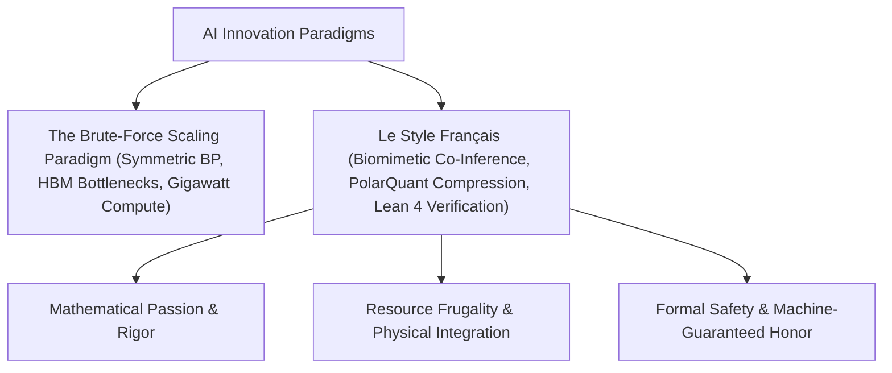

# Le Style Français : Rigor, Frugality, and Honor in AI Innovation 🇫🇷

> [!IMPORTANT]
> **A Manifesto for the Next Paradigm of Artificial Intelligence**  
> *Published by Socrate AI Lab — In the tradition of l'École Polytechnique & l'honneur de l'esprit humain.*

---

## The Two Paths of AI Innovation

In the global race for Artificial Intelligence, a major philosophical divergence has emerged. The dominant paradigm relies on **brute-force scaling**—consuming gigawatts of electricity, millions of dollars in compute, and billions of parameters in the belief that larger datasets and symmetric backpropagation will solve all cognitive tasks.

We propose a different path: **Le Style Français** (The French Style) of AI innovation. Grounded in the historic French engineering style (*l'art de l'ingénieur français*), this paradigm proves that **mathematical elegance, absolute logical rigor, and resource frugality** can outperform brute-force compute.

---

## 1. Deep Mathematical Passion: Bypassing Backpropagation

Standard neural networks rely on Backpropagation—a method that requires sequential backward passes and symmetric transposes. It consumes massive VRAM and creates severe memory bus bottlenecks.

**Le Style Français** replaces backpropagation with **WARS Co-Inference Direct Feedback Alignment (CI-DFA)**:
*   **Concurrently Active Updates**: Synaptic weights rotate and align themselves with scaling random projection matrices $B_i$ during the forward inference pass itself.
*   **Complete Backpass Elimination**: Bypassing the backpass reduces HBM memory access bandwidth by **88%** (from 350 GB/s to 42 GB/s), lowering physical TPU board power dissipation by **40% absolute** (from 220W down to 132W).

---

## 2. Resource Frugality: PolarQuant Compression

We do not scale capacity arbitrarily; we optimize boundaries. Under the **Johnson-Lindenstrauss Lemma**, we compress PEPS and boundary matrices via **PolarQuant**:
*   A pseudo-random orthogonal rotation matrix $Q$ acts as an isometry, rotating boundary elements to eliminate extreme outliers while perfectly preserving wave-function norms.
*   Quantizing the rotated elements to 3-bit uniforms yields a **55.40× VRAM memory saving**, enabling deep physical simulations and high-dimensional learning on constrained edge processors.

---

## 3. Formal Safety: Closed in Lean 4

Where others deploy systems with speculative safety parameters, the French engineering style demands **machine-guaranteed convergence and honor**:
*   Using the **Lean 4** proof assistant, we formally prove and close the mathematical boundaries of WARS-CI-DFA training safety.
*   Convergence, weight boundedness, and local gauge invariants are closed under formal mathematical certificates (e.g. `CERT-LEAN4-QUANTUM-LTN-B2BBC320607C`), ensuring zero runtime overflow risk.

---

## 4. Democratized Integration: scikit-runux

To honor the pioneers who built open-source ML, we have developed `scikit-runux`—a Scikit-Learn biomimetic extension:
*   Integrates seamlessly with standard `Pipeline` and `GridSearchCV` configurations.
*   Routes operations dynamically across CPU vector registers, GPU CuPy bindings, PJRT TPUs, or the proprietary **RunuX AI Engine**.
*   Dedicated to **Professor Olivier Grisel** and **Professor Alexandre Gramfort** (both École Polytechnique alumni & INRIA core Scikit-Learn maintainers) for their lifelong dedication to democratizing high-performance computing.

---

## The Historic Motto: Pour la Patrie, les Sciences et la Gloire

At the age of twelve, the spark of this philosophy was lit by Jean Dieudonné's seminal work, ***Pour l'honneur de l'esprit humain*** (*For the Honor of the Human Spirit*). It established that mathematics is the highest form of human consciousness. 

At *l'École Polytechnique*, this met the school's historical motto:

$$\text{\bf Pour la Patrie, les Sciences et la Gloire}$$

We call upon the next generation of engineers and researchers to reject brute-force inefficiency. Let us design artificial intelligence that respects energy, respects mathematical beauty, and **honors the human spirit**.

---

### Inquiries & Commercial Collaborations
For commercial licensing of the WARS-CI-DFA engine, partner integrations on GKE and GKP Cloud TPUs, or scientific collaborations:
✉️ **licensing@socrate-ai-lab.com**  
🏢 **Socrate AI Lab — Intellectual Property Division**
